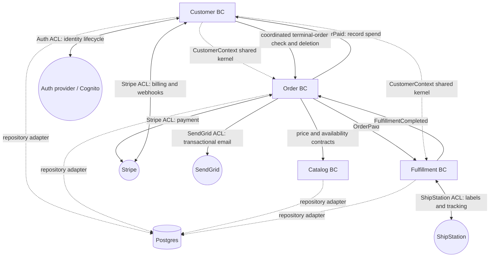

# Difinity Architecture & Coding Standard

**One architecture and coding standard for humans and agents**

> **Version 3.0 · 10 September 2026 · Architecture and coding edition**
>
> A common standard for designing application architecture and writing understandable, testable, maintainable code. It covers domain modelling, dependency boundaries, backend ports and adapters, frontend structure, file organisation, implementation rules and code-quality testing. Humans and agents follow the same rules.
>
> This is not a delivery handbook. Agent-role protocols, planning/handoff formats, release processes and operational governance are outside its scope. Runtime application concerns such as authentication, transactions, retries, configuration and diagnostics remain in scope because they shape the code and its boundaries.

<a id="how-to-use-this-standard"></a>

## How to use this standard

- **Understand the design:** start with the philosophy and domain model (§§1–4), then apply SOLID and the relevant backend/frontend structure (§§5–6).
- **Write code consistently:** use the coding rules (§7), executable architecture constraints (§8) and inward-out implementation sequence (§9). Put application, UI and provisioning code in their proper locations (§10).
- **Keep boundaries safe and testable:** follow the runtime-boundary rules (§11), write the tests appropriate to each layer (§12), and use the code-review checklist (§13).
- **Use the project’s business meaning:** read its relevant DDD documents, published contracts and architecture decisions. Appendix A demonstrates the DDD documentation set; Appendix C demonstrates the frontend implementation. Do not copy PetPal business policies into an unrelated product.
- **For existing code:** preserve contracts while moving changes towards the target design. Do not mix unrelated rewrites into a feature or permit new boundary violations because legacy code already contains them.

<a id="rules-and-examples"></a>

### Rules and examples

**MUST / MUST NOT** and unqualified directives are requirements. **SHOULD** describes the normal approach; a different approach needs documented rationale and an explicit design decision proportional to its impact. **MAY** permits a choice. Architecture decisions and narrow exceptions are described in §14.

Sections 1–14 contain the standard. Appendices A and C are worked reference designs; Appendix B is the architecture glossary. The engineering constraints apply across products, while business values, provider choices and language/framework syntax in examples are illustrative. Complete and test abbreviated examples before using them as production code.

Markdown is the canonical source. The branded HTML is generated from it, not maintained as a second set of rules.

<a id="table-of-contents"></a>

## Table of Contents

- [1. Philosophy](#1-philosophy)
- [2. What we are trying to achieve](#2-what-we-are-trying-to-achieve)
- [3. Application design approach](#3-application-design-approach)
- [4. Domain-Driven Design](#4-domain-driven-design)
- [5. SOLID across frontend and backend](#5-solid-across-frontend-and-backend)
- [6. Application structure – one philosophy, two mechanisms](#6-application-structure-one-philosophy-two-mechanisms)
- [7. Coding rules – do's and don'ts](#7-coding-rules-dos-and-donts)
- [8. Test-enforced architecture and fitness functions](#8-test-enforced-architecture-and-fitness-functions)
- [9. Implementation sequence – adding new functionality](#9-implementation-sequence-adding-new-functionality)
- [10. Where infrastructure-as-code, UI, and backend code live](#10-where-infrastructure-as-code-ui-and-backend-code-live)
- [11. Configuration, secrets, and observability](#11-configuration-secrets-and-observability)
- [12. Testing the architecture and code](#12-testing-the-architecture-and-code)
- [13. Architecture and code review checklist](#13-architecture-and-code-review-checklist)
- [14. Architecture decisions and consistency](#14-architecture-decisions-and-consistency)
- [Appendix A: PetPal worked example (DDD documentation set)](#appendix-a-petpal-worked-example-ddd-documentation-set)
- [Appendix B – Glossary of architectural terms](#appendix-b-glossary-of-architectural-terms)
- [Appendix C: Frontend implementation reference](#appendix-c-frontend-implementation-reference)

<a id="1-philosophy"></a>

## 1. Philosophy

The goal is **not** "working code." Working code is the floor, not the ceiling. The goal is code that stays **understandable, testable, extensible, and safe to change** as the system grows – whether the next change is made by a human or an agent, tomorrow or in two years.

Four convictions drive every rule in this document:

1. **The business model is the centre. Everything else is a detail.** Frameworks, databases, queues, HTTP, file systems, CLIs, cloud SDKs, browsers, and UI toolkits are *replaceable mechanisms*. The domain – the rules that make the business the business – must not depend on any of them.
2. **Dependencies point inward, toward the domain.** The domain knows nothing about the outside world. The outside world depends on the domain. This single rule produces most of the others.
3. **Make the right thing the only thing the type system allows.** We prefer compile-time guarantees over conventions, named constants over magic strings, value objects over raw primitives, and explicit `Result` returns over hidden exceptions. A reviewer (human or agent) should not have to *remember* a rule that the build can enforce.
4. **Architecture is a property you test, not a diagram you draw.** The boundary between domain and infrastructure is verified by automated checks that fail the build, not by good intentions in a wiki.

These convictions are **language-agnostic**. The mechanisms that enforce them differ by stack (Gradle modules, TypeScript project references, Python packages, Go modules, Rust crates), but the rules are identical everywhere.

<a id="2-what-we-are-trying-to-achieve"></a>

## 2. What we are trying to achieve

Concretely, every application we build should exhibit these properties:

| Property | What it means in practice |
| --- | --- |
| **Domain isolation** | The core business logic compiles and runs with zero infrastructure on its classpath/import graph. You could delete the database adapter and the domain still compiles. |
| **Replaceable edges** | Swapping Postgres for DynamoDB, REST for gRPC, or one payment provider for another touches *adapters only* – never the domain or use cases. |
| **Ubiquitous language** | The words in the code are the words the business uses. One glossary for backend, frontend, docs, and conversations. |
| **Explicit failure** | Expected failures are values (`Result<T, DomainError>`), not thrown exceptions. The caller always knows what can go wrong. |
| **Typed boundaries** | Meaningful values crossing domain/port boundaries use validated value objects, typed enums or explicit domain structures. No untyped `any`/`unknown` business payloads. Primitive internal representations are permitted inside a validated type. |
| **Test-enforced structure** | Architecture rules are encoded as tests/build constraints that fail when violated. |
| **Agent-safe change** | A new feature has an obvious correct home. An agent can find the layer, add the value object → port → service → adapter, and stop – without re-deriving the architecture each time. |

If a change makes any of these *worse*, it is a design defect regardless of whether it "works."

<a id="3-application-design-approach"></a>

## 3. Application design approach

We use a **domain-first, ports-and-adapters (hexagonal)** approach on the backend, and its **equivalent expression** (Feature-Sliced Design) on the frontend. Both are the same idea – covered in detail in §6.

The design sequence for any new application is always:

1. **Model the domain in prose first** – produce the DDD documentation set (§4) before feature/business implementation. Minimal build scaffolding and boundary tests may be created during initial architecture setup.
2. **Stand up the enforced boundary** – create the build-level separation between `core` and `app` and prove the required build gate rejects a framework import into `core`, including compile-time rejection where the stack supports it (§6.5).
3. **Write architecture/fitness tests** (§8) that encode the dependency rules – *before* the code they constrain.
4. **Build inward-out**: domain types & value objects → ports → use cases/services → adapters → composition root.
5. **Verify** at each layer with tests at the right altitude (§12), and run the applicable architecture, coding and test checks (§13).

> **Rule:** No feature/business implementation is written until the relevant business model, contracts and design scope are defined and reviewed, the module boundary is enforced and verified, and the shared `Result`/`DomainError` contracts compile. Initial architecture setup may contain the minimal scaffolding, shared primitives and tests needed to satisfy this gate.

<a id="4-domain-driven-design"></a>

## 4. Domain-Driven Design

DDD is how we discover *what the software is about* and carve it into pieces that can be built and changed independently. This section defines the concepts, illustrates them with the **PetPal pet store**, shows how they translate to backend and frontend, and lists the documentation every project must produce.

<a id="41-the-building-blocks-definitions"></a>

### 4.1 The building blocks (definitions)

| Concept | Definition | Test for "is it this?" |
| --- | --- | --- |
| **Ubiquitous Language** | The single shared vocabulary used by domain experts, code, docs, and UI. | If the business says "Order" and the code says "Purchase," the language is broken. |
| **Bounded Context (BC)** | A boundary within which a model and its terms have one precise meaning. A self-contained slice of the domain. | The same word can mean different things in two BCs (e.g. "Customer" in Billing vs Support). Each BC owns its meaning. |
| **Entity** | An object with a distinct **identity** that persists through state changes. | Two entities with identical fields are still *different* if their IDs differ. |
| **Value Object** | An object defined entirely by its **values**, with no identity; immutable. | Two value objects with equal fields are interchangeable (e.g. `Money(500, "AUD")`). |
| **Aggregate** | A cluster of entities and value objects treated as one unit for consistency. | It has invariants that must always hold together. |
| **Aggregate Root** | The single entity that is the entry point to an aggregate; the *only* thing outside code may reference or mutate. | Outside code calls `order.place()`, never `order.items[2].price = …`. |
| **Domain Event** | A record that something meaningful happened in the domain, in past tense. | `OrderPaid`, `CustomerRegistered`. Used to decouple BCs. |
| **Domain Policy / Domain Service** | A pure function/object expressing a business decision that doesn't naturally belong to one entity. | Authorization, discount calculation, conflict resolution. |
| **Anti-Corruption Layer (ACL)** | A translation boundary that converts an external system's concepts into our domain language so foreign types never leak inward. | "Stripe `PaymentIntent`" exists *only* inside the Stripe ACL, nowhere else. |

<a id="bounded-context-vs-aggregate-root-vs-entity-how-they-nest"></a>

#### Bounded Context vs Aggregate Root vs Entity – how they nest

```text
Domain (the whole business: PetPal)
└── Bounded Context           e.g. "Order"   – a slice of the domain with its own model
    └── Aggregate              e.g. the Order aggregate – a consistency boundary
        └── Aggregate Root     e.g. Order      – the one entry point; enforces invariants
            ├── Entity         e.g. OrderItem  – identity, but only reachable via the root
            └── Value Object   e.g. Money, Quantity, FulfillmentMethod – no identity, immutable

```

- A **Bounded Context** is *strategic*: it draws lines between *models*. BCs do not share internal types; they communicate via published contracts (APIs) or domain events, and they may share a small, deliberate **Shared Kernel** (e.g. `CustomerId`).
- An **Aggregate Root** is *tactical*: it draws a *transactional consistency* line *inside* a BC. Anything inside the aggregate is only ever touched through the root.
- An **Entity** has identity; a **Value Object** does not. Prefer value objects – they're immutable, comparable by value, and cheap to reason about.

> **Reference one aggregate from another by identity only – never by object reference.** `Order` holds a `CustomerId`, not a `Customer`.

<a id="42-the-petpal-worked-domain"></a>

### 4.2 The PetPal worked domain

> PetPal sells pets, food, and supplies online and via in-store pickup. Customers create accounts, browse the catalog, place orders, and pay by card. Orders are shipped or picked up.

**Bounded Contexts:** `Customer`, `Order`, `Catalog`, `Fulfillment`.

**A few ubiquitous-language entries** (the full glossary lives in Appendix A):

- **Order** – *A Customer's commitment to purchase one or more Products at captured prices, to be delivered or picked up.* Aliases to **avoid**: Purchase, Transaction, Cart, Sale.
- **OrderItem** – *A single Product with a Quantity and a captured UnitPrice within an Order.* The UnitPrice is a **snapshot** – later catalog price changes do not alter it.
- **Money** – *An amount with a currency.* Both fields required; never a raw float. Aliases to avoid: Price, Amount, Cost.

**The** `Order` **aggregate root** enforces invariants such as:

1. `place()` is rejected if the items list is empty → `EmptyOrderError`.
2. `addItem()` / `removeItem()` are rejected unless status is `Draft` → `OrderImmutableError`.
3. `cancel()` is rejected once status is `Paid`, `Fulfilled`, or `Completed`.
4. `UnitPrice` and the approved discount snapshot are captured at placement; draft prices are indicative. `subtotalAmount = Σ(UnitPrice × Quantity)` and `totalAmount = subtotalAmount − discountAmount`, computed rather than independently mutable. Money carries currency; cross-currency arithmetic is rejected. Appendix A defines the pricing contract; each project documents its discount rates and rounding in its domain model.
5. `Order` references other aggregates by identity only (`CustomerId`, `ProductId`).

**Domain events** (`Order`): `OrderDrafted`, `OrderPlaced`, `OrderPaid`, `OrderCancelled`, `OrderFulfilled`. When an Order is paid, `OrderPaid` is emitted and the **Fulfillment** BC reacts by creating a `Shipment` or `PickupReservation` – the two BCs never call into each other's internals.

**ACL example (Stripe):** `PaymentIntent`, `CheckoutSession`, and Stripe status strings exist *only* inside `acl-stripe.md` and its adapter. The ACL maps `payment_intent.succeeded` → `Order.confirmPayment(paymentRef)` and converts `StripeException` into `Result.err(DomainError)`.

<a id="43-how-ddd-translates-to-backend-and-frontend"></a>

### 4.3 How DDD translates to backend and frontend

The **domain meaning and published contracts are shared across the stack**, not implementation source or every backend field. The ubiquitous language is the same on both sides – there is **one glossary for the whole product**. What differs is *how each side is structured around that shared model* (see §6).

| DDD concept | Backend expression | Frontend expression |
| --- | --- | --- |
| Bounded Context | A module/package owning domain + ports + services for that BC | One `features/{bc}/` folder; **features never import each other** |
| Aggregate Root | Domain object in `core/domain` with command methods | Pure domain model or read projection in `features/{bc}/domain`; immutable snapshots or typed local commands, never arbitrary field writes |
| Value Object | `core/domain` value object + smart constructor | `domain/` value object (e.g. `Money`, typed `OrderId`) |
| Domain Event | Published by a service; consumed by another BC/handler | Usually consumed *from the backend* (the FE rarely originates domain events) |
| ACL | Outbound adapter translating an external SDK | The **DTO → domain mapper** is the ACL: wire-format strings live only in `XxxDto`/`XxxMapper` |
| Ubiquitous Language | Type/field names match the glossary exactly | Same – if backend says `GraphEntity`, the widget says `GraphEntity`, never `node`/`object`/`item` |

> **One glossary, one truth.** The frontend does **not** invent its own DDD docs. It consumes the same `context-map.md`, `domain-terms.md`, and `bc-*.md` the backend was built from, and adds a `feature-map.md` linking each BC to its feature folder, API endpoints and terms. Frontend interaction/view-state documentation may supplement it without inventing a competing business glossary.

<a id="one-domain-mapped-to-both-sides-the-order-aggregate"></a>

#### One domain, mapped to both sides – the `Order` aggregate

One approved business model guides both stacks. The backend remains authoritative for access control, transactions and persisted aggregate invariants. A frontend may use a smaller projection and local validation/state rules; it does not have to reimplement backend repositories or every aggregate command. Its data cannot be trusted merely because the UI validated it. Read this table top-to-bottom as "one concept → its BE home → its FE home":

| DDD element (from `aggregate-order.md`) | Backend (ports & adapters) | Frontend (FSD) |
| --- | --- | --- |
| `Order` aggregate root + invariants | `core/domain/order.ts` – command methods (`place()`, `cancel()`), invariants enforced here | `features/order/domain/order.ts` – semantically aligned pure projection/local model, no HTTP/UI |
| `Money`, `Quantity` value objects | `core/domain/money.ts` (smart constructor → `Result`) | `features/order/domain/money.ts` (same shape) |
| `OrderStatus` (Draft…Cancelled) | `core/domain/order-status.ts` enum/sealed type | `features/order/domain/order-status.ts` enum – **never** the wire strings |
| `OrderId`, `CustomerId` identifiers | branded value objects in `core/domain` | `extension type`/branded ids in `features/order/domain` |
| **Driven port** `OrderRepositoryPort` | interface in `core/ports/out`, implemented by a DB adapter | the per-BC client `features/order/data/order-api.ts` (returns `Result`) **is** the FE's equivalent abstraction |
| **Driving port** `PlaceOrderUseCase` | `core/services/place-order.ts` behind an in-port | a `presentation/` provider action (or a `domain` service if logic is complex/reused) |
| **ACL** (translate wire ↔ domain) | outbound adapter implementing a port | `features/order/data/order-mapper.ts` – wire strings `'placed'`/`'shipping'` live **only** here |
| **Domain event** `OrderPaid` | emitted by the service; Fulfillment BC reacts | usually *received* from the backend; the FE rarely originates domain events |

> The line you protect is identical in both columns: **the moment data reaches** `domain/`**, it is already typed, validated, and speaking the ubiquitous language.** On the backend the outbound adapter guarantees that; on the frontend the mapper does. Same job, two names.

<a id="44-required-ddd-documentation-set-before-business-implementation"></a>

### 4.4 Required DDD documentation set (before business implementation)

Create these in `docs/ddd/`. Humans and agents must read the relevant approved set before feature/business implementation. The model is language-agnostic prose and tables; illustrative snippets use the project's language. Clarify unresolved domain questions rather than treating example data as project facts.

```text
docs/ddd/
  context-map.md          # Mermaid diagram + relationship table (BCs + external systems)
  domain-terms.md         # Ubiquitous-language glossary, with "aliases to avoid"
  bc-{name}.md            # One per bounded context: purpose, what lives here, what does NOT,
                          #   business rules, driving & driven ports
  aggregates/
    aggregate-{name}.md   # One per aggregate root: invariants, commands, events, repo interface
  acl/
    acl-{system}.md       # One per external system: translation maps, forbidden concepts,
                          #   error translation, idempotency

docs/frontend/
  feature-map.md          # FE only: BC → feature folder → endpoints consumed → terms used

```

See Appendix A for the exact format of each file, fully worked for PetPal.

<a id="45-contract-and-example-completeness"></a>

### 4.5 Contract and example completeness

A project DDD set MUST inventory every bounded context, aggregate and external system actually used. Each aggregate specification includes members, property types/mutability, invariants, commands with pre/postconditions, events and payloads, repository absence/error semantics, ownership and consistency boundaries. Each ACL includes inbound/outbound mappings, error/status translation, idempotency and sensitive-data rules. A command invoked by an ACL must exist in the domain/use-case contract. A listed external provider must appear in the context map and ACL inventory. An excerpt in Appendix A is a model of the required format, not permission to leave a real project's documentation incomplete.

Use domain events and approved published contracts across contexts. An aggregate performs no remote checks itself. The application layer coordinates cross-context decisions, retries and durable workflows; the aggregate enforces its local invariants using typed facts. Where atomic state change and eventual side effects are required, persist events through a transactional outbox or equivalent documented mechanism, with idempotent consumers and explicit failure/recovery states.

<a id="5-solid-across-frontend-and-backend"></a>

## 5. SOLID across frontend and backend

**SOLID is binding across backend and frontend, for humans and agents.** Apply the principles to cohesive responsibilities and contracts, not mechanically to file counts or keywords. Document and explicitly decide any deviation under §14. A violation is a design defect until resolved. SOLID is *how* we keep ports-and-adapters / FSD honest.

<a id="s-single-responsibility"></a>

### S – Single Responsibility

A class, function, module, or BC has **one reason to change**.

- Multiple unrelated reasons to change signal a split. The word "and" alone is not proof of an SRP violation.
- A use case may coordinate domain work and ports for **one business intent**, including persistence and recording a durable domain event. It must not also own an unrelated background process, launch unmanaged work or mix transport/infrastructure mechanics into core. Put independent work in a separate handler/orchestrator with durable state.
- **Failure pattern (real):** a capture service that saved the record *and* launched a background coroutine to sync a graph. Two responsibilities + an infrastructure leak into the core. Correct shape: capture saves; a separate orchestrator sequences capture → sync as a job.

<a id="o-openclosed"></a>

### O – Open/Closed

Open for extension, closed for modification.

- Extend deliberate variation points rather than adding scattered vendor/string branches. A new payment provider normally implements `BillingGatewayPort` instead of altering another provider's adapter.
- Adding a sealed variant may legitimately require updating an exhaustive match. Let the compiler expose all affected cases and update their tests. OCP is not a ban on modifying existing code or an excuse for unnecessary abstraction.
- **Tell:** a giant `switch`/`if-else` over a string discriminant *inside the core* signals a missing port or a missing sealed type.

<a id="l-liskov-substitution"></a>

### L – Liskov Substitution

Subtypes must be substitutable for their base type without surprising callers – **including error semantics**.

- Every implementation of a port must honour the port's contract. A repository adapter that *throws* where the contract says *return* `Result.err` violates LSP.
- One adapter returning `Result.err(NotFound)` and another returning `Result.ok(null)` for the same condition is an LSP violation. Pick one; document it on the port.
- Test fakes must obey the same contract as real adapters (idempotency, ordering, error shape).

<a id="i-interface-segregation"></a>

### I – Interface Segregation

Don't force callers to depend on methods they don't use.

- Prefer **multiple narrow ports** over one wide one: `ListThoughtsUseCase`, `GetThoughtUseCase`, `UpdateThoughtUseCase` – not one `ThoughtService` with seven methods.
- Split read/write surfaces (`ThoughtReadPort` / `ThoughtWritePort`) when a context shouldn't see both.
- On the frontend, a widget that needs only `currentUser.email` should depend on a narrow selector, not a fat `AuthProvider`.

<a id="d-dependency-inversion"></a>

### D – Dependency Inversion

High-level modules depend on **abstractions**, not concretions. Abstractions don't depend on details.

- The `core` defines ports; adapters implement them; the **composition root** selects and wires concrete adapters. Adapter implementations and their dedicated tests may know their own concrete types; domain/use-case code may not.
- A use case must **never** import an HTTP client, an ORM table, a vendor SDK class, or a concurrency/global-scope primitive. It depends on a port.
- **Tell:** any `import` in `core` of a third-party SDK, framework type, or platform API is a DI violation – and should fail an architecture test (§8).

<a id="solid-review-checklist-every-change-must-answer-yes-to-all"></a>

### SOLID review checklist (every change must answer "yes" to all)

- [ ] **S** – Each new/changed unit has a single reason to change.
- [ ] **O**: Changes use deliberate extension points; exhaustive variant handling and tests are updated where required, without scattered vendor branches.
- [ ] **L** – Every new port implementation honours the contract, including error semantics.
- [ ] **I** – No new port bundles unrelated responsibilities; callers don't depend on unused methods.
- [ ] **D** – No high-level module (`core`, `domain`) imports an infrastructure type; wiring is in the composition root.

A "no" on any line is a blocker. **SOLID and shipping speed do not conflict** – a violation in code that "works" costs more later than it saves now. If the correct fix is large, *split the change*; never accept "I'll fix it later."

<a id="6-application-structure-one-philosophy-two-mechanisms"></a>

## 6. Application structure – one philosophy, two mechanisms

> **The philosophy is identical on both sides: the domain is the centre, dependencies point inward, and infrastructure lives at the edges.** The backend expresses this as **ports-and-adapters (hexagonal)**. The frontend expresses it as **Feature-Sliced Design (FSD)**. They are two mechanisms for the same idea – and the **"core" means the same thing in both**: framework-free domain logic that depends on nothing outward.

<a id="61-the-shared-mental-model"></a>

### 6.1 The shared mental model

Both stacks have three conceptual zones, even though they name them differently:

| Zone | Meaning | Backend (P&A) | Frontend (FSD) |
| --- | --- | --- | --- |
| **Core / Domain** | Pure business model & decisions. No framework. The centre. | `core/domain`, `core/services`, `core/ports` | `features/{bc}/domain` |
| **Edges / Adapters** | Translation to/from the outside world. | `adapters/inbound`, `adapters/outbound` | `features/{bc}/data` (API client, DTO, **mapper = ACL**) |
| **Delivery / Wiring** | What the user or process touches; composition. | `adapters/inbound` (HTTP/CLI), `app/container` | `features/{bc}/presentation` (widgets/providers), `app/` composition |

**Why the difference is justified:** a backend genuinely swaps persistence, queues, and external APIs, so the ceremony of formal port interfaces pays for itself. A frontend's "infrastructure" is thin (typically one HTTP backend, one local store, one platform) – you are not swapping Postgres for Mongo in the browser. So the frontend keeps the *valuable* parts of the discipline and drops the ceremony that wouldn't earn its keep.

**What transfers to the frontend:** BC module organisation, ubiquitous language, `Result<T, DomainError>`, typed value objects/IDs, no infrastructure types in domain models, per-BC API clients (never one monolith). **What does not:** a formal port interface for every dependency, separate DTO→domain mapper *classes* for trivial cases, and use-case classes for every operation (introduce those only when business logic is genuinely complex and reused).

<a id="62-backend-structure-ports-and-adapters"></a>

### 6.2 Backend structure – ports and adapters

```text
core/                       # framework-free – enforced by the build, not by convention
  domain/                   # value objects, entities, aggregate roots, pure policies
  ports/
    in/                     # driving ports: use cases the outside world can invoke
    out/                    # driven ports: capabilities the core needs from the world
  services/                 # use-case implementations; orchestrate domain + ports
  shared/                   # Result, DomainError – no framework deps

app/                        # depends on core + ALL infrastructure
  adapters/
    inbound/                # HTTP controllers, CLI, cron, workers, webhooks, UI controllers
    outbound/               # DB adapters, HTTP clients, SDK wrappers, queues, auth providers
  config/                   # typed config, parsed & validated once at startup
  container/                # composition root – wires concrete adapters to ports
  main/                     # process bootstrap

```

**Dependency law (this is the whole point):**

```text
domain        -> own domain + approved core/shared primitives
ports         -> domain + shared contract types
services      -> domain + ports + shared
core/shared   -> no other internal layers; pure technical dependencies only
app/adapters  -> inward contracts + implementation libraries; not bootstrap/wiring
app/container -> selects and wires concrete implementations
app/main      -> process bootstrap/lifecycle through the composition root
core          -> never imports app

```

If `core` can import the framework without the required gate failing, the boundary is not enforced. See §6.5.

<a id="63-frontend-structure-difinitys-feature-sliced-design-profile"></a>

### 6.3 Frontend structure: Difinity's Feature-Sliced Design profile

This is Difinity's **bounded-context-oriented FSD profile**, not a claim that every upstream FSD methodology uses this exact folder taxonomy. Use this documented profile consistently instead of mixing incompatible layouts.

```text
src/ (or lib/)
  features/                 # one folder per bounded context
    {bc-name}/
      data/                 # API client, DTOs, mappers (the ACL), local cache
      domain/               # models, typed IDs, enums, value objects, Result types – PURE
      presentation/         # providers/blocs/hooks, widgets/components, pages
  shared/
    core/                   # pure Result, errors, identities and shared-kernel contracts
    api/                    # configured transport, auth/error handling; no feature endpoints
    design/                 # design tokens, reusable UI primitives
  app/                      # routing, cross-feature composition and dependency wiring

```

**Layer dependency (one-way, never reverses):**

```text
presentation coordinators -> own domain/view models + injected typed per-BC client
UI components             -> typed view models + presentation actions; no transport/DTOs
domain                    -> own domain + shared/core only (PURE)
data                      -> own domain + shared/core + shared/api + HTTP/SDK libraries
shared/core               -> pure technical primitives; no UI/network/storage
shared/api, shared/design -> approved implementation libraries; no feature imports
app                       -> feature public surfaces and composition only

```

**Two hard frontend rules:**

1. `domain/` **is a no-import zone for infrastructure.** No HTTP client, no UI framework, no storage library inside `domain/`. If you're importing them there, move the code to `data/` or `presentation/`.
2. **Features may not import each other.** A feature talks to another BC only through `shared/` types (e.g. `CustomerId`, a tenant/identity context) or through the backend API. No `import '../order/domain/order'` inside the `catalog` feature.

<a id="64-where-the-core-is-and-how-the-mapping-holds"></a>

### 6.4 Where the "core" is, and how the mapping holds

The thing we protect is the same in both stacks: **a pure domain that depends on nothing outward.** Concretely:

| Idea | Backend home | Frontend home |
| --- | --- | --- |
| Domain model / aggregate / value object | `core/domain` | `features/{bc}/domain` |
| Use case / business orchestration | `core/services` (always) | `features/{bc}/presentation` provider, or a `domain` service when logic is complex/reused |
| Driven port (what the core needs) | `core/ports/out` interface | Implicit: the typed per-BC API client in `data/` |
| Adapter (talks to the world) | `app/adapters/outbound` | `features/{bc}/data` (client + DTO + mapper) |
| **ACL (translate foreign concepts)** | outbound adapter implementing a port | the **DTO → domain mapper**: wire strings (`'placed'`, `'shipping'`) live *only* in `XxxDto`/`XxxMapper` |
| Composition / wiring | `app/container` | `app/` providers & routing |

> **Mnemonic:** *The mapper is the frontend's anti-corruption layer; the outbound adapter is the backend's.* In both cases, the moment data crosses into the domain it is already typed, validated, and speaking the ubiquitous language.

<a id="65-enforced-module-separation-compile-time-not-convention"></a>

### 6.5 Enforced module separation (compile-time, not convention)

The `core ↔ app` (backend) and `domain ↔ data/presentation` (frontend) boundaries are enforced by the **build/CI gate**, not merely by code review. Use compile-time dependency isolation where the stack supports it and static import/manifest checks as necessary. The mechanism is stack-specific; the rule is universal.

```text
Kotlin/JVM   → Gradle multi-module; :core has no Spring/JPA on its classpath.
TypeScript   → project references/packages + enforced manifests/import rules; not tsconfig alone.
Python       → separate package; no framework deps in core's pyproject.toml.
Go           → separate module in go.work; core/ imports only stdlib (+ domain).
Rust         → separate crate; core/ has no tokio/axum/sqlx dependency.
Dart/Flutter → domain/ libraries import no package:flutter / package:<http-client>.

```

**Verify it during initial architecture setup:** intentionally add a forbidden framework import to `core`/`domain` and confirm the required build/CI command fails. In a compiled module system, demonstrate compile-time failure too. If ordinary compilation permits the import, a mandatory static architecture check must reject it. Keep regression fixtures for this proof (§8).

<a id="66-frontend-boundaries-in-practice"></a>

### 6.6 Frontend boundaries in practice

Components MUST receive typed view models or domain projections, not raw API DTOs, maps or HTTP response objects. They express intent through presentation actions. A provider/controller may coordinate an injected typed client for its own BC; it must not import a raw HTTP client, read browser globals in domain code, or pass transport details to components. Browser, storage and platform access belongs at the appropriate data/platform edge.

A DTO-to-domain transformation is always a boundary responsibility, but a separate mapper class is optional when a small pure function is sufficient. A formal frontend port interface is optional; an injectable typed API contract with a fakeable seam is not optional. Complex/reused **pure** logic may move to a domain service; I/O orchestration must not move into the pure domain.

Keep `shared/core` separate from configured transport and UI. A shared HTTP instance/factory is acceptable; a multi-context business-client singleton is not. Cross-feature pages compose public presentation surfaces in `app/`, not by importing another feature's internals. Appendix C supplies the detailed layout, DTO/error pipeline and provider reference.

<a id="7-coding-rules-dos-and-donts"></a>

## 7. Coding rules – do's and don'ts

These rules apply in every language. Examples are illustrative pseudocode; translate idioms to your stack.

<a id="71-value-objects-and-smart-constructors"></a>

### 7.1 Value objects and smart constructors

**Do** wrap every meaningful value in a value object created through a smart constructor. Use the project's approved identity term: `ActorId`, `CustomerId`, or a genuinely distinct product-specific `UserId`. These are never interchangeable aliases. Use value objects for identifiers (`ActorId`, `OrderId`), semantically distinct strings (`EmailAddress`, `ChannelName`), constrained numbers (`Money`, `Percentage`, `Confidence`), meaningful durations/timestamps, and paths/URLs/hosts that cross boundaries.

```text
# GOOD – invalid states are unrepresentable
type UserId = Branded<string, "UserId">

UserId.from(raw):
    if not matches(raw, /^[a-z][a-z0-9_-]{1,63}$/):
        return Result.err(DomainError.INVALID_INPUT("invalid user id"))
    return Result.ok(brand(raw))

```

```text
# BAD – raw primitive across a boundary; nothing stops a wrong string
function getUser(id: string) { ... }          # which string? any string?
saveOrder(orderId, customerId)                 # easy to swap the two args silently

```

**Don't** use escape-hatch constructors (`unsafe`, `unchecked`, raw casts) outside tiny internal factories or tests. If a value is known-valid because the system generated it, still call the smart constructor and unwrap at the composition/test boundary; a failure there is a real bug worth surfacing.

<a id="72-result-based-error-handling"></a>

### 7.2 Result-based error handling

**Core code must not throw for expected failures.** Return `Result<T, DomainError>`.

Expected failures include: invalid input, permission denied, missing entity, failed policy, rate limit, bad state transition, and runtime/tool failures surfaced by an adapter.

```text
# GOOD
PlaceOrder.handle(req) -> Result<OrderPlaced, DomainError>:
    order = repo.getRequired(req.orderId)?       # NotFound is a typed error
    pricing = catalog.quoteForPlacement(order.items, req.customerContext)?
    changed = order.place(pricing)?              # pure validation + state transition
    repo.saveWithEvents(changed.order, changed.events)?  # durable persistence contract
    return Result.ok(changed.order.toPlacedOutcome())

```

```text
# BAD – hidden control flow; caller can't see what fails
function placeOrder(id) {
    const order = repo.findById(id)   // throws if missing?
    order.status = "placed"           // mutates aggregate from outside (also violates SRP)
    repo.save(order)                  // throws on conflict?
}

```

Adapters **may** catch thrown I/O errors, but must convert them to `Result.err(...)` before crossing into the core. Expected failures must not escape as exceptions. A known-valid value may be unwrapped only at a controlled composition/test boundary, where failure signals a programming defect. Unexpected defects are not disguised as an empty state or a routine network error: record sanitised diagnostics, preserve failure classification and return a safe response at the outer application boundary.

<a id="73-no-unknownanybroad-object-at-boundaries"></a>

### 7.3 No `unknown`/`any`/broad `object` at boundaries

Do not use `unknown`, `any`, or untyped maps at domain or port boundaries. Use value objects for known concepts, DTOs for transport shapes, and an explicit `JsonValue` type only for intentionally opaque JSON that must round-trip. Raw external input may initially be `unknown` inside an adapter parser so it can be safely narrowed. It must not cross into domain/port contracts. An internal diagnostic `cause` may also be `unknown`, but must never be serialized to users or stored as business data. Dynamic transport parsing is not a licence to expose an untyped business contract.

<a id="74-no-magic-strings"></a>

### 7.4 No magic strings

**Every meaningful string literal must have a named owner or typed contract.** This includes route paths, event names, action IDs, query keys, enum-like discriminants, config keys, frontmatter keys, HTTP methods (when compared), env-var names, provider/model names, UI state names, and semantic design tokens, including named CSS stacking layers.

```text
# GOOD
const RuntimeKind = { ClaudeCli: "claude-cli", CodexCli: "codex-cli" }
if runtime == RuntimeKind.ClaudeCli: ...

# Frontend: domain enum, not wire strings
enum OrderStatus { Draft, Placed, Paid, Fulfilled, Completed, Cancelled }

```

```text
# BAD
if runtime == "claude-cli": ...
fetch("/admin/setup")
if task.status == "in_progress": ...          # wire-format string leaking into logic

```

The only acceptable raw strings are incidental user-facing copy or tiny local test values – and even then, prefer a named constant when the string has semantic meaning. **Wire discriminants and serialization field names belong in boundary DTOs/mappers/ACLs.** Transport routes, methods and headers belong in named adapter-owned contracts/constants and are consumed by typed clients. Domain code uses its own typed concepts, never foreign string comparisons. A domain enum/value object may have a primitive internal representation; the rule prevents accidental untyped boundaries, not the implementation of types themselves.

<a id="75-dtos-and-boundary-parsing"></a>

### 7.5 DTOs and boundary parsing

HTTP bodies, queue messages, CLI args, webhook payloads, YAML/Markdown frontmatter, and database rows are **not** domain objects. Parse them at the adapter boundary:

1. Receive raw external data.
2. Parse into a DTO close to the adapter.
3. Convert DTO fields into value objects via smart constructors.
4. Return typed validation errors if parsing fails.
5. Pass **only domain types** into core services.

Write paths are symmetric: services hand domain objects to adapters; adapters serialize them. **Ports speak domain language only** – no HTTP requests, SQL rows, raw filesystem paths, SDK response objects or framework types in a core port signature. A meaningful typed location/path value is permitted when the domain genuinely owns that concept; platform filesystem objects and raw path strings are not.

<a id="76-aggregate-integrity"></a>

### 7.6 Aggregate integrity

**Never mutate an aggregate's state from outside.**

```text
# BAD                              # GOOD
task.status = TaskStatus.Done      task.complete()
order.items.push(item)             order.addItem(productId, qty, unitPrice)

```

The aggregate root owns its state machine and invariants. Outside code expresses *intent* through command methods; the root decides whether the transition is legal and returns a `Result`.

<a id="77-forbidden-patterns-banned-outright"></a>

### 7.7 Forbidden patterns (banned outright)

These have appeared in real codebases and are now blockers:

1. **Fire-and-forget from inside a use case** (`GlobalScope.launch { … }`, a top-level background task field in `core`). Violates SRP + DI. *Fix:* emit a domain event or call a higher-level orchestrator that owns the job's state machine.
2. **Type-checking a wire-format string inside core** (`if (sourceType == "url")`). It leaks an external representation. *Fix:* translate at the boundary and use typed variants with exhaustive handling or polymorphic dispatch as appropriate.
3. **Adapters returning differently-typed errors for the same condition** (`Result.err(NotFound)` vs `Result.ok(null)`). Violates LSP. *Fix:* pick one, document it on the port.
4. **Wide "everything" repository ports** mixing unrelated capabilities. A cohesive aggregate repository may legitimately have save/find/delete methods; split by consumer capability or responsibility rather than an arbitrary method-count limit.
5. **A monolith client/singleton passed into every UI component.** A 1,000-line API client covering all BCs is a DI failure. *Fix:* one typed client per BC behind a provider.
6. **Mutating an aggregate's fields from outside** (see §7.6).
7. **Scattering** `env[...]` **/** `process.env` **reads through the app.** *Fix:* parse config once into a typed object (§11).
8. **Returning** `null` **for an expected failure on the frontend** – it makes the UI show an empty state when the network is down. *Fix:* return `Err(NetworkError(...))` and let the UI decide.

<a id="78-file-and-module-organisation"></a>

### 7.8 File and module organisation

Put things where their responsibility belongs: domain concept → `core/domain`; use case → `core/services`; interface the core needs → `core/ports`; external implementation → `adapters`; process wiring → `app`; truly generic helper → `shared`. Prefer small, cohesively named modules (`runtime-selector`, `credential-provider-registry`) over dumping grounds. **Do not create** `utils` unless the helper is genuinely generic and has no better domain name.

<a id="79-immutability-absence-and-failure-contracts"></a>

### 7.9 Immutability, absence and failure contracts

Return immutable value objects, read-only projections and defensive collection snapshots. A `final`/read-only field containing a mutable list is not sufficient protection if callers can change aggregate state through the list. State transitions remain on the aggregate root or pure transition function.

Distinguish **successful absence** from **failure** in every port/client contract. A search may return `Result<Optional<T>, DomainError>` and an empty list may be a valid query result. An operation requiring an existing entity returns a documented `NotFound` error when absent. Never encode network, permission or parse failure as null or an empty collection. All implementations and fakes must use the same semantics. Use an explicit optional type where the language requires it; a nullable success payload is acceptable only when documented as absence, never error.

<a id="710-readable-implementations-and-focused-changes"></a>

### 7.10 Readable implementations and focused changes

- Read the relevant domain model, contracts, existing implementation and tests before editing. Human and agent authors use the same dependency rules and code-quality expectations.
- Name files, types and functions after the domain concept or concrete responsibility they own. Follow the repository's language-specific naming convention consistently; do not introduce a second convention for generated code.
- Use small cohesive functions and explicit inputs/outputs. Split unrelated reasons to change, not every multi-step business operation into a new abstraction.
- Keep business decisions explicit and testable. Prefer a named domain policy over a duplicated conditional hidden in controllers, DTO mappers and UI components.
- Add an interface at a real architectural boundary or variation point, not mechanically in front of every class. Do not build speculative frameworks, generic repositories or unused extension systems.
- Comments explain non-obvious intent, constraints and trade-offs. Remove misleading or stale comments; do not narrate obvious syntax or leave placeholder implementation in a production path.
- Extend the correct existing concept where it remains cohesive. Do not create parallel helpers or near-duplicate models simply because an existing implementation was not inspected.
- Keep changes focused on the stated behaviour. A necessary refactor must preserve observable contracts and have tests; unrelated restructuring is not part of adding a feature.
- When requirements or domain meaning are unclear, clarify them. Neither a human nor an agent should invent business rules to make a type, test or example convenient.


<a id="8-test-enforced-architecture-and-fitness-functions"></a>

## 8. Test-enforced architecture and fitness functions

Architecture is verified, not assumed. Before feature implementation in a new area, establish executable architecture rules and prove that representative forbidden imports fail. Run these checks through the repository’s required verification commands and CI; violations must fail the verification run. A successful ordinary typecheck alone is not proof that an import boundary is enforced.

<a id="81-required-assertions"></a>

### 8.1 Required assertions

**Backend**

1. `core/**` is framework- and infrastructure-free: no ORM, web/HTTP library, cloud SDK, runtime launcher or platform I/O. Its dependency manifest contains only the approved language runtime and framework-free technical dependencies.
2. `core/domain` depends only on its own domain modules and approved `core/shared` primitives. `core/ports` depends on domain and shared contract types; `core/services` depends on domain, ports and shared. `core/shared` imports no domain, port, service or application module.
3. `app/adapters` may depend inward and on their external implementation libraries, but not on `app/container`, `app/main` or configuration parsing/bootstrap. Keep adapter-specific constructor configuration close to the adapter; composition passes validated values into it.
4. Production code outside an adapter's cohesive implementation package does not instantiate that concrete adapter except in `app/container`. Adapter definitions, their internal helpers and dedicated tests are not violations of this rule. Core code cannot know the concrete implementation at all.
5. Port signatures expose domain-language types and documented `Result` semantics, not DTOs, SQL rows, SDK types or transport objects.
6. Raw wire discriminants are absent from core decisions. Dynamic imports, aliases, generated imports and re-exports must not provide a bypass.

**Frontend**

1. Feature `domain/` imports only its own pure domain code and approved `shared/core` contracts. It cannot reach UI, HTTP, browser globals or storage through a direct or transitive dependency.
2. `data/` may import its own domain and approved shared transport/configuration; it cannot import presentation. Presentation coordinators may use an injected typed per-BC client and domain/view-model types; UI components do not import transport/DTO modules or issue raw requests.
3. Feature A cannot import Feature B's internals, including a shortcut through a re-export. Cross-feature composition belongs in the app shell and uses published contracts or deliberately shared kernel types.
4. `shared/core` remains pure. `shared/api` may contain configured transport and interceptors; `shared/design` may use the UI framework. No shared area imports a feature.
5. Per-BC **business API clients** are separate. A single generic configured HTTP transport shared by clients is permitted; a shared client exposing unrelated BC endpoints is not.
6. Frontend, backend and IaC retain separate dependency/build boundaries. Sharing an API schema is not permission to import another deployable's implementation.

**Evidence**

Maintain passing fixtures and failing fixtures for every rule family. Include cross-feature aliases, domain-to-transport via `shared`, framework imports in core, leaked DTO port signatures and forbidden concrete wiring. Verify that the CI command actually discovers the changed files and that intentional violations fail. A rule file that is never run, scans the wrong root or passes with no files is not an architecture gate.

<a id="82-stack-specific-mechanisms"></a>

### 8.2 Stack-specific mechanisms

| Stack | Build boundary | Fitness tooling examples |
| --- | --- | --- |
| Kotlin/JVM | Gradle modules with no framework dependencies in core | ArchUnit, forbidden-dependency checks and compile-fail fixtures |
| TypeScript | Separate packages/project references plus enforced manifests and imports | dependency-cruiser, ESLint, ts-arch or a tested import-graph checker |
| Python | Separate core package without framework dependencies | import-linter and dependency-manifest checks |
| Go | Module/package boundaries and explicit allowed imports | depguard or a custom analyser |
| Rust | Core crate without runtime/framework dependencies | Cargo dependency checks and compile-fail tests |
| Dart/Flutter | Pure Dart domain libraries, separate from Flutter/HTTP dependencies | Analysers, import-layer tests and boundary fixtures |

Use the supported configuration format of the versions pinned in the repository. TypeScript project references or separate `tsconfig` files alone do not forbid arbitrary imports. A Python package boundary alone also does not stop accidental runtime imports. Combine the structural boundary with executable checks.

<a id="83-reference-import-graph-assertions"></a>

### 8.3 Reference import-graph assertions

The following JavaScript is a runnable example of **a subset** of the dependency checks. Feed it normalised project-relative edges from your pinned analyser; resolve aliases and re-exports before checking. An external import is identified with `external: true`. This demonstrates the law without relying on a cross-regex capture substitution or a tool-specific API that may change. It is not the entire architecture suite: signature linting, dependency manifests, dynamic imports, concrete adapter construction and UI-component roles need their own tested checks.

```javascript
function architectureViolations(edges, pureExternal = new Set()) {
  const problems = [];
  const is = (p, root) => p.startsWith(root);
  const feature = p => p.match(/^src\/features\/([^/]+)\//)?.[1];
  const pureAllowed = e => e.external && pureExternal.has(e.to);
  for (const e of edges) {
    const { from, to } = e;
    const add = rule => problems.push({ rule, from, to });
    const sharedCore = is(to, 'src/core/shared/');
    if (is(from, 'src/core/')) {
      if (e.external && !pureAllowed(e)) add('core-external-dependency');
      if (!e.external && !is(to, 'src/core/')) add('core-to-application');
      if (is(from, 'src/core/domain/') && !e.external &&
          !is(to, 'src/core/domain/') && !sharedCore) add('domain-direction');
      if (is(from, 'src/core/ports/') && !e.external &&
          !is(to, 'src/core/domain/') && !is(to, 'src/core/ports/') &&
          !sharedCore) add('port-direction');
      if (is(from, 'src/core/shared/') && !e.external && !sharedCore)
        add('shared-core-direction');
    }
    if (is(from, 'src/app/adapters/') &&
        /^src\/app\/(container|main|config)\//.test(to)) add('adapter-to-wiring');
    const a = feature(from);
    const b = feature(to);
    if (a && b && a !== b) add('cross-feature-import');
    if (/^src\/features\/[^/]+\/domain\//.test(from)) {
      const localDomain = is(to, `src/features/${a}/domain/`);
      const pureShared = is(to, 'src/shared/core/');
      if (!(pureAllowed(e) || (!e.external && (localDomain || pureShared))))
        add('frontend-domain-purity');
    }
    if (/^src\/features\/[^/]+\/data\//.test(from) &&
        /^src\/features\/[^/]+\/presentation\//.test(to)) add('data-to-presentation');
    if (is(from, 'src/shared/') && b) add('shared-to-feature');
    if (is(from, 'src/shared/core/') &&
        !(pureAllowed(e) || (!e.external && is(to, 'src/shared/core/'))))
      add('frontend-shared-core-purity');
  }
  return problems;
}

const assert = require('node:assert/strict');
assert.equal(architectureViolations([
  { from: 'src/core/services/place.ts', to: 'src/core/ports/out/order.ts' },
  { from: 'src/features/order/data/order-api.ts', to: 'src/shared/api/http.ts' }
]).length, 0);
assert.ok(architectureViolations([
  { from: 'src/core/domain/order.ts', to: 'axios', external: true }
]).some(v => v.rule === 'core-external-dependency'));
assert.ok(architectureViolations([
  { from: 'src/features/order/domain/order.ts', to: 'src/shared/api/http.ts' }
]).some(v => v.rule === 'frontend-domain-purity'));
assert.ok(architectureViolations([
  { from: 'src/features/order/data/api.ts', to: 'src/features/customer/domain/customer.ts' }
]).some(v => v.rule === 'cross-feature-import'));
```

The allowlist is for reviewed pure technical dependencies, never a way to allow an HTTP/ORM/UI library into core. Scan every relevant edge, including dependencies of shared modules, and verify transitive closure and generated code in your analyser integration. Do not silence violations with broad exclusions.

<a id="84-build-and-ci-verification"></a>

### 8.4 Build and CI verification

A typical TypeScript gate runs the pinned dependency-cruiser configuration, ESLint layer/import rules and normal tests (which may include ts-arch assertions), in addition to typecheck and build. Backend paths are `src/core/**` and `src/app/adapters/**` in this profile; frontend paths are `src/features/**` and `src/shared/**`. Adapt roots explicitly for a different repository layout and test the adaptation.

```text
install locked dependencies
validate dependency manifests and import graph
run positive and negative architecture fixtures
run typecheck and layer-scoped lint
run domain, service/provider, adapter and required NFR tests
build each deployable and its separate IaC package
fail the verification run on any mandatory failure
```

A new bounded context lacks an enforceable architecture contract until its rules exist, run and pass. Add new forbidden dependency categories and their fixtures in the same change that introduces the dependency elsewhere in the system. See §§12–13 for code testing and the architecture/code-review checklist.

<a id="9-implementation-sequence-adding-new-functionality"></a>

## 9. Implementation sequence – adding new functionality

This is the architecture and implementation sequence for a new feature on backend or frontend. Clarify the business outcome, domain scope and affected boundaries before coding. Follow the architecture and test constraints in §§3–8; the same sequence applies to human and agent authors.

<a id="91-architecture-tests-first"></a>

### 9.1 Architecture tests first

Before writing feature code, ensure the architecture/fitness tests for the target area exist and pass (§8). If you're creating a new BC, write its dependency-rule tests *first*. They are the guardrails for everything that follows.

<a id="92-confirm-the-ubiquitous-language"></a>

### 9.2 Confirm the ubiquitous language

Check the term against `docs/ddd/domain-terms.md`. Use the exact domain word; never a forbidden alias. If the concept is new, **add the glossary entry first** (and update the relevant `bc-*.md`), then code.

<a id="93-design-the-interface-ports-before-the-implementation"></a>

### 9.3 Design the interface (ports) before the implementation

Decide the *contracts* before any concrete code:

- **Driving port (in-port):** what the outside world is allowed to ask the core to do – a use case. *"What action does the user/system want?"* → `PlaceOrderUseCase`.
- **Driven port (out-port):** what the core needs *from* the world to do its job – persistence, external services, time, randomness, notifications. *"What capability does the core depend on?"* → `OrderRepositoryPort`, `PaymentPort`, `EmailNotificationPort`.

Design ports **narrow** (ISP) and **in domain language** (no SDK/HTTP/DTO types).

<a id="94-decide-what-goes-in-the-in-port-the-out-port-and-the-core"></a>

### 9.4 Decide what goes in the in-port, the out-port, and the core

Use this decision guide:

| Question | Where it goes |
| --- | --- |
| Is it a business rule, invariant, or state transition? | **Core domain** (aggregate/value object/policy) – pure, tested exhaustively |
| Is it orchestration of domain + dependencies for one user intent? | **Core service** behind a **driving (in) port** |
| Does the core *need* something from the world (DB, API, clock, queue)? | A **driven (out) port** interface in `core/ports/out`, implemented by an adapter |
| Does it translate an external system's concepts/types? | An **adapter + ACL** (never the core) |
| Does it touch a framework, SDK, HTTP, filesystem, or env? | **Adapter** – and only the adapter |
| Does it wire concretes together? | **Composition root** (`app/container`) |

> **Heuristic:** if you're tempted to `import` a vendor SDK to finish a use case, stop – you've found a missing **out-port**. Define the port in the core; implement it in an adapter.

<a id="95-get-the-abstraction-level-right"></a>

### 9.5 Get the abstraction level right

- **Don't over-abstract.** Don't introduce a port/interface for something with exactly one implementation that will never be swapped *and* never needs faking in tests. (On the frontend, the per-BC API client often *is* the abstraction – a separate formal port would be ceremony.)
- **Don't under-abstract.** Anything the core needs from the world that involves I/O, non-determinism (time, randomness, IDs), or an external system **must** be a port so the core stays pure and testable.
- **Right-size ports** with ISP: one cohesive responsibility per port.
- **Honour LSP:** every implementation (including test fakes) obeys the same contract, including error semantics.

<a id="96-build-inward-out-then-wire"></a>

### 9.6 Build inward-out, then wire

1. Domain values, invariants and contract types; define boundary DTO schemas without importing them into core.
2. Port interfaces (in and out).
3. Use-case/service implementation against the ports.
4. Adapters (inbound + outbound), with parsing/serialization and ACL translation.
5. Composition root wiring.
6. Tests accompany each layer, not just the end (§12); run the applicable architecture and test checks (§13).

<a id="97-keep-ui-and-backend-code-separate"></a>

### 9.7 Keep UI and backend code separate

Frontend and backend are separate deployables with separate structures (§6). They share the ubiquitous language and a versioned published API contract, **not implementation source modules**. Generated transport types/clients may be distributed as separately versioned API-contract artifacts, but remain at the adapter/data edge and must be translated before reaching domain or components. The frontend mapper (its ACL) absorbs wire-format differences; the backend's HTTP adapter produces them. No UI concern ever appears in backend `core`; no backend infrastructure type ever appears in frontend `domain`.

<a id="10-where-infrastructure-as-code-ui-and-backend-code-live"></a>

## 10. Where infrastructure-as-code, UI, and backend code live

A repository (or monorepo) separates *running application code* from *the code that provisions where it runs*. IaC is **provisioning/configuration code, not domain logic** – it must never sit inside `core`/`domain`.

**Recommended top-level layout (monorepo shown; split repos follow the same zones):**

```text
repo/
  backend/                 # ports-and-adapters service(s)
    core/ …                # framework-free domain (see §6.2)
    app/ …                 # adapters, config, composition root
  frontend/                # Feature-Sliced Design app (see §6.3)
    features/ … shared/ …
  infra/                   # Infrastructure-as-Code – provisioning & deployment ONLY
    modules/               # reusable IaC modules (network, db, queue, cdn, …)
    environments/          # per-env composition (dev / staging / prod)
  docs/
    ddd/ …                 # the shared domain documentation set (§4.4)
    frontend/feature-map.md
    adr/                   # architecture decision records (§14)

```

**Rules for IaC:**

- IaC lives in its own top-level area (`infra/`), **never** imported by `core`/`domain`/`app` source. Application code does not read Terraform/Pulumi/CloudFormation/Helm files; it reads **typed config** (§11) produced from the environment those tools provision.
- The boundary between "what the app needs" and "how it's provisioned" is the **typed config object** and **brokered credentials**. The app declares *needs* (a database URL, a queue endpoint, an authority to perform an operation); IaC *satisfies* them.
- IaC is parameterized per environment, reviewed, and versioned like any other code, but it is *adapter/ops-layer* in spirit – outside the hexagon entirely.
- Secrets are provisioned/managed by infra and **brokered** to the app, not baked into source (§11.2).

**UI vs backend separation:** keep them in distinct top-level areas (`frontend/`, `backend/`) with independent builds and architecture tests. Shared business artifacts are `docs/ddd/**` and the published/versioned API contract, including generated boundary-only schema artifacts where used. General toolchain or design-system packages may be reused when they introduce no cross-deployable domain/infrastructure coupling and their ownership is explicit.

<a id="101-worked-example-typescript-iac-pulumi-aws-cdk"></a>

### 10.1 Worked example – TypeScript IaC (Pulumi / AWS CDK)

Even when IaC is written in the *same language* as the app (Pulumi or AWS CDK in TypeScript), it stays **physically and architecturally separate** – its own package, never imported by `core`/`app`/`features`:

```text
repo/
  backend/                 # tsconfig: app code only
  frontend/
  infra/                   # tsconfig: IaC only – NOT referenced by backend/ or frontend/
    package.json           # depends on @pulumi/aws or aws-cdk-lib – these deps live ONLY here
    src/
      network.ts           # VPC, subnets
      database.ts          # RDS/Dynamo – EXPORTS connection target as an output, not a secret
      queue.ts             # SQS/SNS
      service.ts           # the deployable (ECS/Lambda/etc.)
    Pulumi.dev.yaml
    Pulumi.prod.yaml

```

```typescript
// infra/src/database.ts – IaC declares what exists; it does NOT contain domain logic.
import * as aws from "@pulumi/aws";

// Abbreviated shape, NOT a deployable RDS configuration.
// Supply the approved networking, storage, engine, backup and credential configuration.
export const db = new aws.rds.Instance("petpal-db", approvedDatabaseArgs);

export const dbEndpoint = db.endpoint;                       // becomes typed config input
// Provision credentials in a secret manager; broker access where non-disclosure is required.

```

The application consumes a **typed configuration contract** (including endpoint/target values, §11.1) and a separately controlled **credential or capability mechanism** appropriate to its trust boundary (§11.2). It does not import provisioning libraries or IaC implementation modules. A dependency-cruiser/ESLint rule should forbid any import of `@pulumi/*` or `aws-cdk-lib` from `backend/**` or `frontend/**`.

<a id="102-ci-enforcement-of-the-architecture-boundary"></a>

### 10.2 CI enforcement of the architecture boundary

The boundary is enforced by executable checks, not trusted to reviewers alone. Run these checks through the repository’s verification commands and CI. An illustrative verification job:

```yaml
# .github/workflows/ci.yml (illustrative)
jobs:
  verify:
    steps:
      - run: npm ci
      - run: npm run typecheck                 # tsc --noEmit
      - run: npx depcruise --config .dependency-cruiser.cjs src   # architecture boundary
      - run: npm run lint                       # includes no-restricted-imports per layer
      - run: npm test                           # domain + service + adapter + ts-arch
      - run: npm run build

```

If `depcruise`, the layer-scoped lint rules or the `ts-arch` tests fail, the verification run fails. Architecture is an executable constraint, not a convention (§8).

<a id="11-configuration-secrets-and-observability"></a>

## 11. Configuration, secrets, and observability

<a id="111-configuration"></a>

### 11.1 Configuration

Config files/env vars are **adapter inputs**. Parse config **once** at startup (or a reload boundary) into a **typed, validated config object**. Validate all paths, modes, timeouts, hosts, and enum-like values up front. Do **not** scatter `env[...]` reads across the app, pass raw config maps around, or use config strings directly in domain logic. Separate the raw document parser, the typed config model, validation, and composition-root wiring.

<a id="112-secrets-and-credentials"></a>

### 11.2 Secrets and credentials

**Application/business logic should receive narrow capabilities, not secrets.** Express operations through typed ports such as payment charging or email delivery. Credential handling belongs in the corresponding controlled adapter or broker, not in the domain/use case. Separate the credential **source** (keychain/vault/env/command/OAuth), **provider** (typed adapter that obtains material), **delivery** (env/file/stdin/helper/proxy/operation), and **policy** (who may use which credential for which operation). Environment variables and mounted files expose secrets to the receiving process; they do not establish non-disclosure from that process. Choose the mechanism according to the trust boundary (§11.5). **Never log raw secrets, full auth headers, passwords, or unredacted sensitive payloads.**

<a id="113-observability-and-runtime-progress"></a>

### 11.3 Observability and runtime progress

Long-running work must expose **structured progress** – never leave a user staring at "loading" while work happens elsewhere. Track: request ID, current phase, started/elapsed time, actor, target service, application-operation events, deadline, and failure classification. Prefer **typed events** (`RequestStarted`, `OperationStarted`, `OperationCompleted`, `RequestFailed`). Store detailed event tails for debugging but summarize the UI (one row per request, current state visible, detail on drill-down).

<a id="114-identity-authority-and-customer-context"></a>

### 11.4 Identity, authority and customer context

Resolve authenticated identity at the authentication boundary and pass a typed immutable `ActorContext` explicitly through application/client calls. It identifies the actor, relevant tenant scope, granted capabilities and validity/version information appropriate to the project. Never read business identity or entitlement state from a process-global variable. A long-lived UI/session must refresh or invalidate its context when authentication, tenant selection or grants change; "resolve once" means once per validated context lifecycle, not permanently cache authority.

Keep `CustomerContext` distinct: it is a deliberately shared **business snapshot**, for example `CustomerId` plus `MembershipTier`. The authenticated actor may act for a different customer or tenant only with an explicit authorised relationship. Do not interchange `ActorId`, `CustomerId` and `TenantId`; do not replace the PetPal business term `MembershipTier` with a generic subscription `Plan`. A different product may model genuinely distinct subscription plans in its own approved glossary.

Frontend context supports scoped requests and presentation; it is not proof of authority. The backend authenticates and authorises each protected operation, validates tenant/customer ownership and re-evaluates authoritative policy. Pass only the minimal business facts required into pure domain policies, not access tokens or an infrastructure session object. Test stale context, revocation, cross-tenant access and impersonation/delegation boundaries.

<a id="115-non-disclosure-safe-diagnostics-and-user-facing-state"></a>

### 11.5 Non-disclosure, safe diagnostics and user-facing state

When **strict secret non-disclosure** is required, operation brokering or proxy injection outside the untrusted process is mandatory: the caller receives a narrow capability/result, not reusable credential material. Environment variables, mounted files and stdin deliver secrets into a process and cannot satisfy that guarantee merely by changing the delivery format. Record the threat model, scope, lifetime, revocation and audit controls for the selected delivery mechanism.

Keep raw error causes in controlled diagnostics with redaction, access controls and retention appropriate to sensitivity. User-facing errors contain safe typed messages and correlation identifiers, not `exception.toString()`, credentials, raw payloads or stack traces. A broad outer catch may contain an unexpected defect and report a sanitised failure; it must not silently classify all defects as ordinary network errors.

Presentation state must distinguish idle/loading/success/empty/error as needed. Clear loading on completion, cancellation and failure; prevent an older request from replacing newer state; avoid updating a disposed view. Expose typed errors and an appropriate retry/recovery action. Detailed traces belong in authorised diagnostics, not automatically in the UI. See Appendix C.

<a id="12-testing-the-architecture-and-code"></a>

## 12. Testing the architecture and code

Tests are executable specifications of contracts, invariants and dependency rules. Humans and agents must write tests alongside the code they constrain. Test at the narrowest layer that can establish the behaviour; a passing UI journey is not evidence that a domain invariant or architecture boundary is enforced.

<a id="121-tests-by-layer"></a>

### 12.1 Tests by layer

| Layer | Required focus | Test mechanism |
| --- | --- | --- |
| Domain | Smart constructors, invariants, policies, state transitions, currency/rounding rules and meaningful edge cases | Fast, deterministic unit tests with no I/O; property-based tests where invariants benefit from generated cases. |
| Application services / use cases | One business intent, port interactions, sequencing, expected failures and durable event recording | In-memory fakes that honour the same contracts as production adapters. |
| Adapters / ACLs | Input parsing, DTO/domain mapping, external status/error translation and protocol details | Boundary tests plus integration tests against representative test infrastructure. |
| Published contracts | Schema validity, compatibility, optional fields, absence/failure semantics and consumer/provider expectations | Contract tests shared with or exercised against real adapters and their fakes. |
| Persistence and messaging | Transactions, aggregate persistence, concurrent updates, outbox consistency, duplicate delivery and idempotency | Isolated integration tests with controlled data and realistic storage/messaging behaviour. |
| Architecture | Permitted imports, domain purity, port signatures, feature isolation and module boundaries | Static/build checks and positive/negative regression fixtures (§8). |
| Frontend presentation | Typed view models, state transitions, user intent, cancellation, stale responses and disposal | Provider/controller tests with an injected fake per-BC client; component tests without raw HTTP. |
| End-to-end | A small set of critical user journeys and application wiring | Focused browser/application tests; never a substitute for the lower layers. |

<a id="122-boundary-and-failure-cases"></a>

### 12.2 Boundary and failure cases

For each relevant contract, test valid input, invalid input and the edge conditions that determine correctness. Include:

- Absent data versus an actual failure; denied access versus missing resources where the contract distinguishes them.
- Unexpected external shapes, unknown discriminants, malformed values and unsupported schema versions.
- Aggregate transitions that are allowed and forbidden, including concurrent modification and repeat commands.
- Timeouts, cancellation, bounded retries, duplicate requests/events and partial dependency failure. Verify that retries do not duplicate business effects.
- Authentication, authorisation, tenant/customer ownership, expired or revoked context and relevant injection risks. Frontend validation never replaces server-side checks.
- Money precision, currency compatibility, rounding and immutable pricing/discount snapshots.
- UI loading, success, empty and error states; old responses must not overwrite newer requests or update disposed views.
- Sanitised error messages and diagnostic output. Tests must demonstrate that credentials and sensitive payloads do not leak.

<a id="123-user-interface-and-performance-correctness"></a>

### 12.3 User-interface and performance correctness

UI code must support keyboard use, meaningful semantics, accessible names, visible focus and the applicable WCAG AA requirements. Combine automated checks with the interactions they cannot adequately verify. Test responsive states and supported locales, including formatting, text expansion and directionality where relevant.

Test performance-sensitive algorithms and boundaries against explicit project budgets and representative data sizes. State the workload and measurement conditions. Do not substitute a universal latency or coverage percentage for a justified correctness requirement. Use visual regression tests where layout stability matters; investigate differences rather than blindly accepting new baselines.

<a id="124-deterministic-and-maintainable-tests"></a>

### 12.4 Deterministic and maintainable tests

- Control clocks, randomness, IDs and external dependencies through injected seams. Use synthetic or sanitised fixtures and repeatable setup/teardown.
- Keep tests independent of execution order and shared mutable state. Use the real persistence adapter in the tests that claim to verify persistence semantics.
- Assert observable behaviour and contracts, not incidental private implementation details. Refactoring without changing behaviour should not require rewriting an entire suite.
- Keep fakes honest: the same input, absence and failure rules apply to fakes and production implementations. Contract-test both where practical.
- Name tests after the rule or behaviour they specify. It should be clear which invariant or regression a test protects; a separate task-tracking protocol is not required by this standard.
- Do not conceal flaky tests through repeated runs until green. Fix the source of nondeterminism.
- Add a failing regression test for a defect where practical, then prove the fix. Add a negative architecture fixture when introducing a new boundary rule.
- Run type checking, linting, architecture checks, applicable tests and compilation through reproducible repository commands. A supplied command is not a command that has run. State any unrun checks or limitations plainly; do not claim unverified code is verified.

Coverage is a diagnostic, not proof of correctness. A high percentage does not excuse missing invariant, failure or boundary tests. Project-specific coverage targets must not be lowered simply to conceal a failing change.

<a id="13-architecture-and-code-review-checklist"></a>

## 13. Architecture and code review checklist

Use this checklist for human-written and agent-written changes alike. It evaluates the code and design, not release readiness or a team handoff process. An applicable failed item is a code/design issue to fix, or an explicitly documented architecture exception under §14; it is not an invitation to silently weaken the rule.

<a id="131-architecture-and-domain"></a>

### 13.1 Architecture and domain

- [ ] The code uses the project’s ubiquitous language; identifiers, entities and value objects have the right bounded-context meaning.
- [ ] Aggregate invariants are enforced through the root or a pure transition function, not arbitrary field mutation.
- [ ] Cross-aggregate references use identities. Cross-context interactions use published contracts/events, never another context’s internals.
- [ ] Domain code is pure and imports only permitted domain/shared contracts. No framework, UI, database, HTTP, SDK or configuration mechanism leaks inward.
- [ ] Use cases coordinate one business intent through focused ports; adapters own external mechanics; the composition root wires concrete implementations.
- [ ] SOLID is applied to cohesive responsibilities and explicit contracts, without speculative abstractions or needless layers.
- [ ] The target-area dependency rules are enforced by build/static checks and tested with forbidden-import fixtures.

<a id="132-types-contracts-and-implementation"></a>

### 13.2 Types, contracts and implementation

- [ ] Meaningful values use validated value objects or explicit domain types; invalid external input cannot bypass smart constructors.
- [ ] External input is parsed and mapped at the boundary. DTOs and foreign wire discriminants do not enter domain/port contracts or UI components.
- [ ] Expected failures use typed `Result` values. Successful absence, domain failure and unexpected defects remain distinct.
- [ ] Collections and snapshots cannot be mutated indirectly. State transitions preserve documented invariants.
- [ ] Named contracts/constants own meaningful literals; no scattered magic strings, untyped business maps or boolean mode switches hide domain concepts.
- [ ] Files and modules have a clear responsibility and live in the correct layer. There are no circular imports, dumping-ground utility modules or unrelated refactors.
- [ ] Configuration is typed and resolved at explicit boundaries. Secret material and unsafe diagnostics do not reach business logic, user-facing errors or logs.
- [ ] Relevant I/O has defined timeout, cancellation, retry and idempotency behaviour; unmanaged background work is not hidden in a use case.
- [ ] Persisted data and published-contract changes have explicit compatibility and versioning semantics, rather than accidental coupling to consumers.

<a id="133-frontend"></a>

### 13.3 Frontend

- [ ] The application follows the documented BC-oriented FSD profile consistently.
- [ ] Each feature owns its `data/domain/presentation` layers; `shared/core` remains pure, and shared implementation packages import no feature internals.
- [ ] Presentation coordinators use injected typed per-BC clients. Components consume typed models/actions, not DTOs, HTTP objects or raw transport clients.
- [ ] Domain projections agree with backend business meaning without pretending the frontend is authoritative for security or persistence invariants.
- [ ] Loading/error/empty states, stale-request handling, cancellation and disposal are correct.
- [ ] UI code uses design tokens, accessible semantics and supported responsive/localised states.

<a id="134-tests-and-clarity"></a>

### 13.4 Tests and clarity

- [ ] Tests protect invariants, contract boundaries and meaningful failure cases at the correct layer (§12).
- [ ] Fakes match the production port/client semantics, including absence and failure.
- [ ] Applicable typecheck, lint, architecture, test and build commands pass; any unperformed checks are identified as unverified.
- [ ] Affected domain terms, contracts, feature maps and architecture decisions match the implemented design.
- [ ] Names and structure explain intent. Comments explain non-obvious reasons and constraints, rather than restating code.
- [ ] The implementation is the smallest coherent design that solves the stated problem without weakening the architecture.

<a id="14-architecture-decisions-and-consistency"></a>

## 14. Architecture decisions and consistency

<a id="141-one-standard-project-specific-models"></a>

### 14.1 One standard, project-specific models

This document defines the common architecture and coding rules for humans and agents. A project’s domain model, API contracts and accepted architecture decisions apply those rules to its business and technology choices. They do not create a competing general standard.

Read the relevant existing domain documents and code before changing a design. Reuse established terms and suitable extension points. When business meaning or a contract is unclear, clarify it rather than inventing a convenient interpretation. A coding prompt or an example is not a reason to disregard a dependency rule.

Examples in Appendices A and C demonstrate the standard. PetPal’s business policies and Flutter syntax are illustrative, not mandatory choices for every product. Framework-specific mechanisms may differ; purity, dependency direction and contract semantics do not.

<a id="142-record-consequential-architecture-decisions"></a>

### 14.2 Record consequential architecture decisions

Keep short architecture decision records in `docs/adr/` for consequential trade-offs, such as context boundaries, consistency mechanisms, shared-kernel contracts, integration styles or a justified exception to a rule. Include:

| Field | Content |
| --- | --- |
| Context | The concrete design problem, constraints and affected boundaries. |
| Decision | The chosen design, status and date. |
| Alternatives | Credible alternatives and why they were not selected. |
| Consequences | Effects on correctness, complexity, coupling, security, compatibility and maintenance. |
| Contracts and verification | Affected interfaces/invariants and the tests that enforce the decision. |
| Exception, if any | The exact rule varied, narrow scope, rationale and agreement by the responsible architecture owner. An exception does not silently apply elsewhere. |

An ADR should explain a real trade-off, not provide ceremonial justification for bypassing a test. A proposed exception is not an accepted design. Review or supersede a decision when its assumptions change, and update the corresponding contracts and fitness tests.

<a id="143-keep-the-reference-consistent"></a>

### 14.3 Keep the reference consistent

Markdown is the canonical source; HTML is its generated reading format. Change the source rather than maintaining separate rules in each format. Keep project-specific facts in the project’s domain/architecture documents and link to this standard for general rules.

Delivery planning, agent orchestration, task handoffs, organisational approvals, release checklists and operational runbooks are outside this document’s scope. They must not be confused with the architecture and code-quality requirements defined here.

<a id="appendix-a-petpal-worked-example-ddd-documentation-set"></a>

## Appendix A: PetPal worked example (DDD documentation set)

> **Illustrative reference, not an application specification or runnable source.** PetPal sells pets, food and supplies online, accepts card payment, and offers shipping or in-store pickup. Its example business rules demonstrate the documentation format. They do not prescribe membership thresholds, cancellation policy or deletion behaviour for other products. Each product defines its own model before business implementation; PetPal's rules are illustrative. Repository signatures below are language-neutral contract sketches, not complete production implementations.

This appendix is self-contained: Order and Customer have representative BC and aggregate artifacts; A.10 supplies Catalog, Fulfillment and remaining external-system templates. File labels describe where approved project documentation belongs, not a requirement to retrieve an external note. Use the main standard for architecture, SOLID, coding and code-quality testing requirements.

**Canonical language and conflict resolutions**

- Use `CustomerId`, `CustomerContext` and `MembershipTier { Standard, Silver, Gold }` throughout. `TenantContext`, `UserId` and alternative tier labels are not aliases for these PetPal concepts.
- `ActorContext` represents an authenticated caller and verified permissions. `CustomerContext` is a customer-owned, immutable business snapshot containing `CustomerId` and `MembershipTier`, with typed provenance/version metadata when freshness matters. It is neither an authentication credential nor authority to act for that customer. A verified actor may operate for a separately identified customer only after authorisation.
- All domain/port/command/event boundaries use validated meaningful values. External primitives are confined to DTOs, serializers and ACLs. For example, use `EmailAddress`, `CustomerName`, `PostalAddress`, `CurrencyCode`, `PaymentReference` and `OccurredAt`, not raw strings, numbers or vendor objects. Optional state uses `Option<T>`; expected failure uses `Result<T, DomainError>`.
- Draft prices are indicative. The binding price, eligible discount and fulfilment choice are captured at placement. Discounted totals use the explicit equation in A.4, resolving the original undiscounted sum example without applying a discount twice.
- Aggregates make local, pure decisions. Applications coordinate Catalog reservations, payment, cross-BC deletion checks, persistence and event delivery through ports. Events trigger follow-up work; aggregates never perform external I/O or launch background work.
- All idempotency keys follow the single scheme in A.5. Payment retries, webhook deduplication, spend recording and deletion steps use that scheme with distinct scopes and operations.

<a id="a1-context-mapmd"></a>

### A.1 `context-map.md`

**Context Map: PetPal**



Arrows describe contract/data flow, not permission to import another BC's internal model or call another aggregate directly.

| Relationship | Pattern and ownership | Published contract and consistency |
| --- | --- | --- |
| Order → Catalog | Customer-Supplier, Catalog upstream | `CatalogPort` supplies current typed prices and availability/reservation evidence at placement. Later catalog changes cannot reprice placed Orders. A reservation, not a stale availability read, protects concurrent inventory allocation. |
| Order → Fulfillment | Customer-Supplier, Order upstream | Durable `OrderPaid` starts creation of a `Shipment` or `PickupReservation`. No direct aggregate-to-aggregate call. |
| Fulfillment → Order | Published event contract | `FulfillmentCompleted` is mapped to `MarkOrderFulfilledUseCase`; duplicate delivery is harmless. |
| Order → Customer | Published event contract | `OrderPaid` supplies `CustomerId`, `OrderId` and paid `Money` to record lifetime spend once. Stripe events do not independently add the same spend. |
| Customer → Order / Fulfillment | Small, deliberately governed Shared Kernel | `CustomerContext` carries `CustomerId` and `MembershipTier` for business decisions. Consumers receive a snapshot, not a mutable Customer reference. Schema sharing does not imply shared persistence or authentication. |
| Customer deletion → Order | Application workflow using Order-owned contracts | Obtain an exclusive deletion/order-creation gate, check all Orders are terminal (`Completed` or `Cancelled`), then coordinate deletion. A.8 describes races and recovery. |
| Auth provider → application | ACL, not a customer shared kernel | Verify external credentials and translate identity/claims into `ActorContext`; authorise separately against the target `CustomerId`. |

**External integration inventory**

| System | Artifact | Owner and direction | Reference |
| --- | --- | --- | --- |
| Stripe | `acl/acl-stripe.md` | Order checkout/payment; Customer billing profile, checkout/portal and relevant inbound billing webhooks | A.5 |
| SendGrid | `acl/acl-sendgrid.md` | Order-owned outbound transactional email, triggered by durable events | A.10.3 |
| ShipStation | `acl/acl-shipstation.md` | Fulfillment outbound label creation and inbound tracking | A.10.4 |
| Auth provider, Cognito as an example | `acl/acl-auth.md` | Customer identity lifecycle; inbound authenticated actor translation | A.10.5 |
| Postgres | `acl/acl-postgres.md` or equivalent persistence-boundary artifact | Each BC owns its repository adapter, schema and transactions; no cross-BC table access | A.10.6 |

Postgres is a persistence mechanism, not a BC or a business upstream. Its adapter still documents row/domain translation and errors. Shared storage is not a licence to bypass published contracts.

<a id="a2-domain-termsmd"></a>

### A.2 `domain-terms.md`

**Domain Terms: PetPal Ubiquitous Language**

The same glossary governs backend, frontend, documentation and conversation. “Aliases to avoid” prevents accidental synonyms; it does not ban a separately defined concept in another BC. For example, an authenticated actor is not renamed Customer, and a payment transaction may be a valid provider concept confined to its ACL.

| Term | Definition and business context | Related terms | Aliases to avoid |
| --- | --- | --- | --- |
| Customer | Person with a PetPal account, created at sign-up, able to browse and place Orders. Aggregate root for identity/profile, membership and saved addresses. Any supported saved-payment references or customer-owned preferences are accessed through this root, never mutated as independent children; product preferences remain out of scope. | CustomerId, MembershipTier, Order | User, Account, Shopper, Buyer |
| CustomerId | Immutable, system-assigned UUID wrapped in a validated identifier. Shared customer identity, never a provider's customer ID. | Customer, CustomerContext | UserId, TenantId, AccountId |
| CustomerContext | Immutable Customer-owned snapshot of CustomerId and MembershipTier; optional typed version/provenance supports freshness checks. Business data shared by an explicit kernel contract, not caller authority. | ActorContext, CustomerId | TenantContext, Session, AuthContext |
| ActorContext | Verified caller identity and authorisation-relevant claims, produced by the authentication boundary. A typed ActorId may map to a CustomerId but is not interchangeable with it. | ActorId, Permission, CustomerId | CustomerContext, raw token |
| Order | Customer's commitment to purchase one or more Products at captured prices, delivered or collected. Draft is preparation; confirmation of the cart places the Order and creates the commitment. | OrderItem, CustomerId, FulfillmentMethod, Money | Purchase, Transaction, Cart (pre-Order concept), Sale |
| OrderItem | A single Product with positive Quantity and UnitPrice inside exactly one Order. An owned entity, reached only through Order. Draft UnitPrice is indicative; placement captures the binding snapshot. | Order, ProductId, Money, Quantity | LineItem, CartItem, Item |
| FulfillmentMethod | `Shipping(PostalAddress)` or `PickUp(StoreId)`, chosen at checkout and frozen at placement. | Order, Shipment, PickupReservation | DeliveryMethod, ShippingMethod (too narrow) |
| MembershipTier | Loyalty tier `Standard`, `Silver` or `Gold`, used for discount eligibility. Starts Standard and only upgrades. Example thresholds are in A.8. | Customer, Order | Plan, Tier, Level, PricingTier |
| Money | Exact amount together with CurrencyCode. Used for UnitPrice, TotalAmount and, where separately modelled, ShippingFee. Never a raw float or unlabelled number. | OrderItem, Order, CurrencyCode | Price, Amount, Cost when used as substitutes for the value type |
| UnitPrice | Per-unit catalog price snapshot represented by Money, binding at placement. Named field, not a replacement for the Money type. | OrderItem, PricingSnapshot | mutable catalog reference |
| Quantity | Strictly positive whole-number quantity, validated by a smart constructor. | OrderItem | unchecked count |
| Placed | Order state after customer confirmation and before payment. Items, binding prices, discount and fulfilment method cannot change. Entered by Place. | Draft, OrderStatus | Submitted, Confirmed, Created |
| Draft | Uncommitted Order state while items or fulfilment choice can change. | Placed, Order | Cart, Basket, Pending (suggests submission) |
| OrderStatus | `Draft`, `Placed`, `Paid`, `Fulfilled`, `Completed`, `Cancelled`; only command-governed transitions in A.4 are legal. | PaymentStatus | provider status string |
| PaymentStatus | Typed payment-attempt outcome, separate from OrderStatus: Pending, ActionRequired, Processing, Authorised, Confirmed, Failed or Abandoned. | PaymentReference, PaymentAttemptId | Stripe status, OrderStatus |
| Product | Catalog-owned sellable pet, food or supply identified by ProductId. Order copies published purchase facts, not a Product aggregate reference. | Catalog, ProductId | OrderItem |
| Shipment | Fulfillment aggregate for shipping a paid Order to a captured PostalAddress. | FulfillmentMethod, ShipmentId | Order, carrier response |
| PickupReservation | Fulfillment aggregate for collection of a paid Order at a StoreId. | FulfillmentMethod | Shipment, Cart |
| SavedAddress | Customer-owned address entity with SavedAddressId and validated PostalAddress; at most five in this example. | Customer | standalone customer aggregate |
| LifetimeSpend | Currency-safe accumulated paid Money, incremented once per OrderPaid. Legacy `lifetimeSpendCents` means AUD minor units, not an untyped port value. | MembershipTier, SpendRecorded | balance, credit |
| DeletionInitiated | Past-tense event recording that the Customer deletion flag was set after coordinated eligibility checks. Not evidence that every external deletion has finished. | DeletionWorkflowId | AccountDeleted, deletion complete |

**Supporting value vocabulary.** `OrderId`, `OrderItemId`, `ProductId`, `StoreId`, `SavedAddressId`, `ShipmentId`, `PickupReservationId`, `ActorId`, `PaymentAttemptId`, `PaymentReference`, `BillingCustomerReference`, `PaymentMethodReference`, `EventId`, `OperationId`, `IdempotencyKey`, `AggregateVersion`, `OccurredAt`, `PlacedAt`, `PaidAt`, `CreatedAt`, `EmailAddress`, `CustomerName`, `PostalAddress`, `CancellationReason`, `PaymentFailureReason`, `CheckoutUrl` and `PortalUrl` are distinct meaningful types. Wrapping a primitive does not replace validation. Names introduced by an actual project require glossary entries, ownership and smart-constructor constraints.

`CustomerContext` may contain copied values; this does not breach identity-only aggregate references. No consumer receives the Customer aggregate or its mutable address collection. Shipping copies the selected PostalAddress so later address-book edits cannot reroute a placed Order.

<a id="a3-bc-ordermd"></a>

### A.3 `bc-order.md`

**Purpose:** manage the purchase lifecycle from Draft through payment and fulfilment handoff; enforce pricing and inventory conditions at placement.

**Strategic classification:** Core, the revenue-generating flow.

**Lives here:** Order root; owned OrderItem; OrderId and OrderItemId; OrderStatus; FulfillmentMethod; currency-safe pricing/discount snapshots; payment-attempt facts and domain policies. Shared values such as Money and CustomerId have explicit shared-kernel ownership.

**Does not live here:** Product definitions (Catalog), shipment tracking (Fulfillment), customer membership calculation (Customer), authentication mechanics (Auth ACL), payment gateway mechanics (Stripe ACL), email SDK types or database rows.

**Example business rules**

1. Items may be added or removed only in Draft. Empty Orders cannot be placed.
2. Placement captures current catalog prices, validated availability/reservation, fulfilment choice and eligible MembershipTier discount from an authoritative CustomerContext. A draft estimate is not a guaranteed price.
3. After placement, items, quantities, prices, discount and fulfilment method are immutable. Lifecycle/payment facts still change through commands.
4. Cancellation is allowed only in Draft or Placed, never Paid, Fulfilled, Completed or already Cancelled. A replay of a successful request can return its stored result without calling Cancel again.
5. Order references Customer and Product aggregates by IDs only. The application authorises ActorContext against CustomerId and checks that the Customer is active.
6. OrderPaid triggers Fulfillment and Customer spend recording. OrderPlaced triggers confirmation email through a separate handler. No root calls another BC, SDK or background runtime.
7. Payment outcome is not inferred from a browser redirect. Verified, reconciled payment evidence is required; a failed attempt leaves the Order Placed so payment can be retried.

**Driving ports, one narrow use case per operation**

| Port | Typed input and output intent |
| --- | --- |
| CreateDraftOrderUseCase | ActorContext, CustomerId, FulfillmentMethod, OperationId → OrderId |
| AddItemUseCase / RemoveItemUseCase | ActorContext, OrderId, ProductId + Quantity / OrderItemId, OperationId → updated Order view |
| SetFulfillmentMethodUseCase | ActorContext, OrderId, FulfillmentMethod, OperationId → updated Draft view |
| PlaceOrderUseCase | ActorContext, OrderId, OperationId → placed Order view |
| ProcessPaymentUseCase | ActorContext, OrderId, PaymentAttemptId, OperationId → typed PaymentInitiation |
| ConfirmOrderPaymentUseCase | trusted integration actor, OrderId, PaymentConfirmation, OperationId → payment result |
| MarkOrderPaymentFailedUseCase | trusted integration actor, OrderId, PaymentFailure, OperationId → payment result |
| MarkOrderPaymentAbandonedUseCase | trusted integration actor, OrderId, PaymentAbandonment, OperationId → payment result |
| CancelOrderUseCase | ActorContext, OrderId, CancellationReason, OperationId → cancellation result |
| MarkOrderFulfilledUseCase / CompleteOrderUseCase | trusted/authorised ActorContext, OrderId, fulfilment/completion evidence, OperationId → lifecycle result |
| ListOrdersUseCase | ActorContext, CustomerId, typed pagination/filter values → Order summaries |
| CheckTerminalOrdersUseCase / DeleteCustomerOrdersUseCase | deletion service actor, CustomerId, DeletionGateToken / DeletionPermit, OperationId → eligibility / deletion result |

Every input is a named typed request and every return is `Result<Success, DomainError>`. Table arrows are not raw multi-argument transport APIs.

**Driven ports**

- Order lookup, save, customer-history and deletion ports, segregated as A.4 specifies.
- `CatalogPort`: `getPrice(ProductId)` for an indicative/current Money quote, plus batch price-and-availability/reservation contracts for placement. `Place` receives typed accepted evidence rather than invoking this port.
- `CustomerContextReadPort`: obtain current membership snapshot and customer activity/deletion-gate state; frontend-submitted membership is not trusted.
- `PaymentPort`: initiate and reconcile a payment attempt using OrderId, placed Money and typed references; implemented by a payment ACL.
- `EmailNotificationPort`: typed recipient/template/business content → delivery receipt, used by the OrderPlaced handler, not the aggregate.
- Unit-of-work/outbox, inbox/idempotency, clock/ID-generation and customer-order gate capabilities, each with narrow domain-language interfaces. Runtime scheduling remains an adapter concern.

**Placement workflow and consistency**

The application authorises the actor, acquires the customer/order-creation gate, loads the Draft and its version, gets current CustomerContext and Catalog price/reservation evidence, and builds an immutable `PlacementSnapshot`. The pure root validates and accepts that snapshot. Save the root and pending events atomically with optimistic version checking. Reservation finalisation/release is a durable workflow: conflicts or abandoned placement release the reservation idempotently, and failures are retried/reconciled. A mere availability read cannot guarantee inventory under concurrency.

ProcessPayment first authorises the request and durably records StartPayment with its PaymentAttemptId and stable provider-operation identity. PaymentAttemptStarted then triggers a durable worker that calls PaymentPort; provider responses/webhooks return through the typed payment use cases. Retries reuse the recorded operation identity rather than creating a new charge. This separates payment intent, external work and confirmed domain outcome.

Payment and cancellation are also coordinated. Serialize Order transitions; prevent new payment attempts for cancelled Orders, abandon/cancel outstanding provider attempts when cancellation is accepted, and reconcile late successful charges. A late payment never silently moves Cancelled back to Paid. An unexpected charge enters an explicit refund/manual-resolution workflow, not hidden aggregate I/O. Production policy must define its resolution and audit requirements.

<a id="a4-aggregatesaggregate-ordermd"></a>

### A.4 `aggregates/aggregate-order.md`

**Root and responsibility:** Order captures the Customer's purchase commitment with a price snapshot at placement and protects its local consistency boundary.

**Members:** owned OrderItem entities; Money, Quantity and identifier values; `OrderStatus { Draft, Placed, Paid, Fulfilled, Completed, Cancelled }`; `FulfillmentMethod = Shipping(PostalAddress) | PickUp(StoreId)`; typed pricing, discount and payment evidence. OrderItemId identifies an entity within its root; outside code must not mutate it directly.

<a id="properties-and-mutability"></a>

#### Properties and mutability

| Field | Type | Mutability |
| --- | --- | --- |
| id | OrderId | Immutable |
| customerId | CustomerId | Immutable |
| items | ReadonlyList<OrderItem> | Root-owned; add/remove/change only in Draft; binding price assigned by Place |
| status | OrderStatus | Changed only by legal commands |
| fulfillmentMethod | FulfillmentMethod | Initial Draft preference; may change in Draft; captured and frozen by Place |
| pricingSnapshot | Option<PlacementSnapshot> | Absent in Draft; set once by Place, then immutable |
| subtotalAmount | Money | Computed as sum of UnitPrice × Quantity |
| discountAmount | Money | Indicative before placement; frozen via DiscountSnapshot at placement |
| totalAmount | Money | Computed, never independently stored as aggregate state |
| placedAt | Option<PlacedAt> | Set once on Place |
| paidAt | Option<PaidAt> | Set once on successful payment confirmation |
| payment | Option<PaymentAttemptFacts> | Through payment commands only; typed attempt/reference/status/failure |
| version | AggregateVersion | Incremented by successful persistence; used for concurrency control |

An OrderItem has immutable OrderItemId and ProductId, positive Quantity and Money UnitPrice. Replacement through a root Draft command is permissible; direct child field writes are not. The collection exposed to callers is read-only.

<a id="money-and-total-invariants"></a>

#### Money and total invariants

1. `Money` contains exact minor units and a validated `CurrencyCode`; arithmetic is checked for range and currency compatibility. Never use binary floating point, silently mix currencies, or assume every currency has two decimal places. Addition/subtraction require equal currencies; multiplying by Quantity preserves currency. Expected overflow/mismatch/invalid-value outcomes return `Result.err`.
2. This worked Customer-loyalty example uses AUD. Prices, discounts, payment amounts, lifetime spend and thresholds are AUD. A real multi-currency product needs an explicit conversion/loyalty policy; do not sum unlike currencies.
3. `subtotalAmount = Σ(item.unitPrice × item.quantity)`.
4. `totalAmount = subtotalAmount − discountAmount`, with `0 ≤ discountAmount ≤ subtotalAmount` and matching currency. Without a discount, the original example `totalAmount = Σ(UnitPrice × Quantity)` holds exactly. With a discount, that undiscounted sum is the **subtotal**, not a contradictory second total invariant.
5. A pure pricing policy evaluates MembershipTier at placement and produces a `DiscountSnapshot` with typed policy version, eligibility basis and exact rounded Money. This example specifies eligibility, not an invented discount percentage. The approved project must define rates, rounding and allocation rules. Never discount already-discounted UnitPrices a second time.
6. Draft totals and discounts are estimates. Place refreshes all binding prices and discount facts in one accepted snapshot. A later catalog price or tier change cannot alter a placed Order.
7. ShippingFee is a valid Money use elsewhere in the vocabulary, but is not charged by this minimal Order equation. A project that charges it must explicitly revise the equation, snapshot and tests; never silently add it.
8. Persist the snapshot inputs, not an independently mutable total. Events or read projections may store the calculated total as a historical fact, with consistency checked against the immutable snapshot.

<a id="other-enforced-invariants"></a>

#### Other enforced invariants

- Place rejects empty items with `EmptyOrderError` and rejects non-Draft state with a typed transition error.
- AddItem, RemoveItem and SetFulfillmentMethod reject non-Draft state with `OrderImmutableError`. Removing an absent OrderItemId returns `OrderItemNotFoundError`.
- Cancel accepts only Draft or Placed and requires a validated CancellationReason; otherwise return `OrderNotCancellableError`.
- All placed items have positive Quantity, one order currency and current accepted Catalog reservation/pricing evidence. Invalid evidence returns a typed error, not a network call.
- ConfirmPayment requires Placed, a recognised active PaymentAttemptId, reconciled PaymentReference, and exact placed amount/currency. Failed/abandoned or stale attempts cannot override a confirmed payment. Duplicate processing is handled before reapplying effects.
- MarkFulfilled requires Paid; Complete requires Fulfilled. Completed and Cancelled are terminal for deletion purposes. Paid and Fulfilled are not terminal.
- Cross-aggregate links use CustomerId and ProductId only, not Customer or Product objects. Snapshot values and published event payloads are not mutable aggregate links.

<a id="commands"></a>

#### Commands

All commands return `Result<CommandOutcome, DomainError>`, take typed arguments, and stage typed events for atomic persistence. Time, generated IDs and already-validated external evidence are supplied by the application. The root does not read a clock, repository, gateway or another BC.

| Command | Preconditions | Postconditions | Events |
| --- | --- | --- | --- |
| CreateDraft(OrderId, CustomerId, FulfillmentMethod, OccurredAt) | Valid values; no local prior Order. Application has authorised an active Customer. | Draft, empty items, initial method, no binding snapshot | OrderDrafted |
| AddItem(OrderItemId, ProductId, Quantity, indicativeUnitPrice: Money) | Draft; positive quantity, valid currency, unique child ID | Owned item appended with indicative price | ItemAdded |
| RemoveItem(OrderItemId) | Draft; item exists | Item removed | ItemRemoved |
| SetFulfillmentMethod(FulfillmentMethod) | Draft | Preference updated | FulfillmentMethodChanged |
| Place(PlacementSnapshot, PlacedAt) | Draft; nonempty; accepted snapshot matches items, customer and method; price/inventory/discount invariants satisfied | Placed; prices, discount and method frozen; placedAt set | OrderPlaced |
| StartPayment(PaymentAttemptId) | Placed; no conflicting active/confirmed attempt | Typed pending attempt recorded | PaymentAttemptStarted |
| ConfirmPayment(PaymentConfirmation, PaidAt) | Placed; matching active attempt, amount/currency/reference evidence | Paid; confirmed payment and paidAt recorded | OrderPaid |
| MarkPaymentFailed(PaymentFailure) | Placed; matching non-confirmed attempt | Attempt Failed with typed reason; Order remains Placed and eligible for a new attempt | OrderPaymentFailed |
| MarkPaymentAbandoned(PaymentAbandonment) | Placed; matching non-confirmed attempt | Attempt Abandoned; Order remains Placed | OrderPaymentAbandoned |
| Cancel(CancellationReason) | Draft or Placed only | Cancelled; cancellation reason recorded | OrderCancelled |
| MarkFulfilled(FulfillmentCompletion) | Paid; evidence belongs to this Order | Fulfilled | OrderFulfilled |
| Complete(OrderCompletion) | Fulfilled; completion evidence accepted | Completed | OrderCompleted |

The terse original `Place()` and `ConfirmPayment(paymentRef)` express domain intent. Their complete reference contracts above explicitly provide evidence needed to enforce that intent without aggregate I/O. Cancelling a payment attempt is not the same as cancelling an Order.

<a id="domain-event-payloads"></a>

#### Domain event payloads

Every event has a typed envelope: `EventId`, `OccurredAt`, root ID, `AggregateVersion`, `CorrelationId`, `CausationId` and `EventSchemaVersion`. Payload fields below are additional business facts, all typed. Publish only after commit, normally through a transactional outbox. Consumers use durable inbox deduplication, not an assumption of exactly-once delivery.

| Event | Business payload |
| --- | --- |
| OrderDrafted | orderId: OrderId, customerId: CustomerId |
| ItemAdded | orderId: OrderId, orderItemId: OrderItemId, productId: ProductId, quantity: Quantity, indicativeUnitPrice: Money |
| ItemRemoved | orderId: OrderId, orderItemId: OrderItemId |
| FulfillmentMethodChanged | orderId: OrderId, fulfillmentMethod: FulfillmentMethod |
| OrderPlaced | orderId: OrderId, customerId: CustomerId, totalAmount: Money, fulfillmentMethod: FulfillmentMethod, placedAt: PlacedAt, pricingSnapshotId: PricingSnapshotId |
| PaymentAttemptStarted | orderId: OrderId, paymentAttemptId: PaymentAttemptId, totalAmount: Money |
| OrderPaid | orderId: OrderId, customerId: CustomerId, paymentAttemptId: PaymentAttemptId, paymentRef: PaymentReference, paidAt: PaidAt, paidAmount: Money, fulfillmentMethod: FulfillmentMethod, items: ReadonlyList<PurchasedItemSnapshot> |
| OrderPaymentFailed | orderId: OrderId, paymentAttemptId: PaymentAttemptId, reason: PaymentFailureReason |
| OrderPaymentAbandoned | orderId: OrderId, paymentAttemptId: PaymentAttemptId, reason: PaymentAbandonmentReason |
| OrderCancelled | orderId: OrderId, customerId: CustomerId, reason: CancellationReason |
| OrderFulfilled | orderId: OrderId, fulfillmentReference: FulfillmentReference |
| OrderCompleted | orderId: OrderId, completedAt: CompletedAt |

The original OrderPlaced/orderId-total-method-time, OrderPaid/orderId-reference-time, OrderCancelled/orderId-reason and OrderFulfilled/orderId payloads are preserved and augmented with the facts their consumers require. Customer consumes paidAmount to record spend; Fulfillment consumes immutable purchased-item and destination/store snapshots, not a live Order aggregate. Version/minimise event PII and define retention/access controls for shipping-address facts.

<a id="repository-contracts"></a>

#### Repository contracts

The original repository capabilities are retained but segregated to avoid an everything-repository. All reads use one absence convention: `findById` returns `Err(OrderNotFound)`, not nullable success. A customer-history query with no matches returns `Ok(empty list)`.

```text
OrderLookupPort.findById(OrderId)
    -> Result<Order, DomainError>

OrderWritePort.save(Order, expectedVersion: AggregateVersion)
    -> Result<SavedVersion, DomainError>

CustomerOrderReadPort.findByCustomerId(CustomerId, OrderPageRequest)
    -> Result<Page<OrderSummary>, DomainError>

CustomerOrderTerminalCheckPort.check(CustomerId, DeletionGateToken)
    -> Result<TerminalOrdersEvidence, DomainError>

CustomerOrderDeletionPort.deleteAllByCustomerId(CustomerId, DeletionPermit)
    -> Result<DeletionReceipt, DomainError>
```

An adapter may implement several interfaces; each caller receives only what it needs. The unit of work saves the aggregate and pending events atomically. Save conflicts return `ConcurrencyConflict`; the application reloads and reapplies intent rather than blindly retrying stale state. Bulk deletion is invoked only by the authorised deletion workflow, never by an aggregate and never without terminal-order evidence and approved retention policy.

**Representative tests:** empty placement; every state/command transition including repeated cancellation; draft repricing; frozen placement price/tier/method; positive quantities; currency mismatch and overflow; zero and nonzero discounts; missing item; exact payment matching; duplicate/out-of-order/late webhooks; concurrent cancellation/payment; optimistic conflicts; outbox recovery; per-consumer OrderPaid deduplication.

<a id="a5-aclacl-stripemd"></a>

### A.5 `acl/acl-stripe.md`

**Purpose and ownership:** Order owns payment/checkout translation; Customer owns billing profile and customer billing-event handling. The historical subscription-webhook ownership label is not a definition of a PetPal Subscription aggregate or a licence to map paid subscriptions to loyalty tiers. If subscriptions are introduced, model their terms, contracts and root explicitly first.

**Inside:** OrderId, CustomerId, Money, PaymentStatus, PaymentAttemptId, PaymentReference, BillingCustomerReference, PaymentMethodReference and Result-based errors.

**Outside, confined to this ACL and adapter:** Stripe `PaymentIntent`, `CheckoutSession`, Stripe `Customer`, `Charge`, `Invoice`, SDK exceptions, metadata shapes, wire event names and status strings.

**Ports:** `PaymentPort` initiates/reconciles Order payments; narrow `BillingCheckoutPort` and `BillingPortalPort` provide the Customer BC's `BillingGatewayPort` capabilities. Core port names describe capabilities, not vendor API objects. A successful provider API response is not by itself authority to mark an Order Paid.

<a id="outbound-translation"></a>

#### Outbound translation

| Domain intent | Stripe API/mechanism | Translation |
| --- | --- | --- |
| ProcessPayment(OrderId, PaymentAttemptId, Money) | `POST /v1/payment_intents` and provider confirmation where required | Convert Money using the currency's minor-unit rules; for this AUD example, cents. Include typed OrderId/attempt correlation as encoded metadata. Return PaymentInitiation, not the SDK object. |
| ReconcilePayment(PaymentReference) | Retrieve provider payment state | Map to typed PaymentObservation, validating linked order, customer, attempt, amount and currency before invoking any confirmation use case. |
| CreateCheckoutSession(CustomerId, BillingCheckoutRequest) | `POST /v1/checkout/sessions` | Encode CustomerId in metadata and maintain a durable mapping to BillingCustomerReference. If the session pays an Order, also correlate OrderId and PaymentAttemptId and use the same payment-confirmation path. |
| OpenBillingPortal(CustomerId, BillingPortalRequest) | Provider billing-portal session API | Return validated PortalUrl; no provider response crosses the port. |

No key such as `order-{orderId}` competes with the canonical scheme below. A new genuine payment attempt is distinct from retrying the same provider operation.

<a id="inbound-webhook-translation"></a>

#### Inbound webhook translation

Verify signature against the unmodified request bytes, validate the configured endpoint/account and relevant livemode expectations, parse to a DTO, then construct typed values. Do not trust webhook metadata alone as authorisation or customer ownership. Resolve stored mappings and reconcile financial facts.

| Stripe event | Typed application command | Pure root effect |
| --- | --- | --- |
| `payment_intent.succeeded` | ConfirmOrderPaymentUseCase(OrderId, PaymentConfirmation) | ConfirmPayment, producing OrderPaid once |
| `payment_intent.payment_failed` | MarkOrderPaymentFailedUseCase(OrderId, PaymentFailure) | MarkPaymentFailed, producing OrderPaymentFailed; stays Placed |
| `payment_intent.canceled` | MarkOrderPaymentAbandonedUseCase(OrderId, PaymentAbandonment) | MarkPaymentAbandoned; does not Cancel the Order |
| Other supported Customer billing events | HandleBillingEventUseCase(CustomerId, CustomerBillingEvent) | Apply only explicitly modelled billing-reference changes. Unsupported event types have no business effect. |

The webhook adapter invokes an application use case, never a repository-loaded root directly. That use case owns idempotency, concurrency, save and outbox. Both checkout and direct-payment paths converge on the same OrderPaid fact; Customer lifetime spend is not credited by a separate Stripe handler.

<a id="stripe-status-domain-status"></a>

#### Stripe status → domain status

These strings are ACL translation entries, never core constants.

| Stripe status | Typed domain value | Action/qualification |
| --- | --- | --- |
| `succeeded` | PaymentStatus.Confirmed | Reconcile and request ConfirmPayment; not a direct status assignment. |
| `requires_payment_method` | PaymentStatus.Failed for a failed attempted payment | Preserves the original “payment failed” mapping in failure-event context. On a newly created intent with no attempt yet, this means payment details are required and maps to Pending, not a fabricated failure. Use attempt/event evidence. |
| `canceled` | PaymentStatus.Abandoned | Abandon the attempt, not the Order. |
| `requires_confirmation` | PaymentStatus.Pending | Await confirmation; do not mark Paid. |
| `requires_action` | PaymentStatus.ActionRequired | Return a typed customer-action requirement. |
| `processing` | PaymentStatus.Processing | Await/reconcile final outcome. |
| `requires_capture` | PaymentStatus.Authorised | Authorised but not yet captured; this example recognises Paid only on confirmed success. |
| Unrecognised/new status | Typed UnsupportedProviderState error or quarantined observation | Alert/reconcile, never guess success or silently change an Order. |

<a id="one-idempotency-key-scheme"></a>

#### One idempotency key scheme

Construct a validated `IdempotencyKey` using a single canonical encoder:

```text
petpal:{scope}:{subjectId}:{operation}:{operationId}
```

- `scope` and `operation` are named enums. Components are deterministically escaped/encoded; generated IDs are non-PII typed identifiers. Enforce the receiving provider's key length/character limits in the adapter. The same logical operation always produces the same key and payload fingerprint.
- Outbound example: `petpal:stripe:orderId:CreatePayment:operationId`. Allocate and persist OperationId once per logical provider action within a PaymentAttemptId; retries reuse it. A new attempt or changed business request receives a new persisted OperationId. Checkout and portal creation have distinct named operations.
- Webhook inbox example: `petpal:stripe:eventId:HandleOrderPayment:eventId`. Here subjectId and operationId are the provider's validated event identifier; a different owning handler uses a different operation name. `WebhookIdempotencyPort` remains the inbound capability, but the previous `stripe:{event.id}` shortcut is replaced by this same scheme.
- Domain-event consumer examples use scope `domain`, subjectId = EventId, operation = `RecordCustomerSpend` or `CreateFulfillment`, operationId = EventId. Each consumer can process the same OrderPaid independently once. Customer additionally protects the business identity OrderId so two different event IDs cannot double-credit one paid Order.
- Deletion workflow steps use scope `deletion`, subjectId = CustomerId, the named step operation and the persisted DeletionWorkflowId as operationId. Retries retain that key.

Persist an inbox claim, processing state and resulting local aggregate/outbox changes atomically where possible. A pre-processing “seen” flag must not lose work after a crash. Retry incomplete work; acknowledge durable success or durable enqueue according to the transport contract. Store/replay outcomes for completed requests, and reject key reuse with a different payload. Use durable workflow records for external calls that cannot share the local transaction. Provider key expiry is not permission to create a duplicate charge: reconcile stored references before retrying an uncertain old operation.

Deduplication does not solve ordering. Use aggregate versions and attempt identity; stale failures cannot reverse Paid, and late success for a cancelled Order goes to the A.3 reconciliation workflow.

<a id="error-translation-and-forbidden-leakage"></a>

#### Error translation and forbidden leakage

| External condition | Core-facing result |
| --- | --- |
| Card declined / failed payment | Err(PaymentDeclined) or typed PaymentFailure observation, as the particular port contract specifies |
| Provider validation failure | Err(InvalidPaymentRequest) |
| Timeout or uncertain transport outcome | Err(PaymentOutcomeUnknown), with stable retry/reconciliation identity |
| Rate limiting | Err(PaymentRateLimited) with typed RetryAfter |
| Provider unavailable | Err(PaymentProviderUnavailable) |
| Invalid signature / unmapped identity / amount mismatch | Err(InvalidWebhook), Err(PaymentMappingNotFound) or Err(PaymentMismatch); no mutation |
| SDK exception | Catch in adapter, translate to the documented DomainError; retain sanitised diagnostic cause outside business payloads |

Forbid vendor classes, status strings, raw JSON and provider exceptions in domain/port signatures. Never log secrets or payment credentials. Test all mappings, unsupported states, mismatched amounts/currency, replay, changed-payload key reuse, reordered callbacks and unknown-outcome recovery.

<a id="a6-frontend-docsfrontendfeature-mapmd"></a>

### A.6 Frontend: `docs/frontend/feature-map.md`

**Feature Map: PetPal Frontend (FSD)**

| Bounded Context | Feature folder | Illustrative API endpoints consumed | Key domain terms in UI |
| --- | --- | --- | --- |
| Customer | `features/customer` | `/api/v1/customers/**` | Customer, MembershipTier, SavedAddress |
| Order | `features/order` | `/api/v1/orders/**` | Order, OrderItem, Money, OrderStatus, FulfillmentMethod |
| Catalog | `features/catalog` | `/api/v1/products/**` | Product, Money, Quantity |
| Fulfillment | `features/fulfillment` | `/api/v1/shipments/**`, `/api/v1/pickup-reservations/**` | Shipment, PickupReservation |

- Reuse A.2 verbatim as the shared vocabulary; no competing frontend glossary or independent business policy.
- Each feature owns its typed `data/XxxApi`; no monolithic cross-BC API client. Sharing a configured transport is allowed, sharing a client containing all business operations is not.
- DTOs and mappers form the frontend ACL. Wire strings such as `placed` and `shipping` exist only in DTO/mapping declarations; domain code uses named types/enums. Route paths are named constants at the edge.
- Parse IDs, Money, addresses and errors at the edge. API clients return `Result`, including network/permission/validation failures, not null or an empty-success list on error.
- UI may display a Draft estimate and indicate that placement refreshes it. It cannot treat local tier/price state as authoritative, mark payment successful from a redirect, or bypass backend authorisation/invariants.
- Shared CustomerContext is a business snapshot; a separate shared ActorContext represents the authenticated caller. Never derive permissions from MembershipTier alone or send an unverified client snapshot as authority.

<a id="a7-frontend-layering-quick-reference-fsd-applied-to-petpal"></a>

### A.7 Frontend layering quick-reference (FSD applied to PetPal)

```text
lib/ (or src/)
  app/                    composition, provider wiring, routing
  features/
    order/
      domain/             order.*, order_item.*, order_status.*, money.*,
                          fulfillment_method.* (pure types and decisions)
      data/               order_dto.*, order_mapper.* (ACL),
                          order_api.* (typed per-BC client returning Result)
      presentation/       order_provider.*, cart_page.*, order_detail_page.*
    customer/
      domain/             customer.*, saved_address.*, membership_policy.*
      data/               customer_dto.*, customer_mapper.*, customer_api.*
      presentation/       profile_provider.*, profile_page.*
    catalog/              domain/, data/, presentation/
    fulfillment/          domain/, data/, presentation/
  shared/
    core/                 result.*, domain_error.*, customer_context.*,
                          actor_context.*, deliberately shared typed IDs
    api/                  configured HTTP client, auth interceptor,
                          transport-error to DomainError translation
    design/               colours, text styles, shared widgets
```

- `domain` imports neither `data`, `presentation`, UI frameworks, HTTP nor storage. Its decisions remain pure.
- `data` imports its domain types and edge libraries, never presentation.
- `presentation` consumes domain types and a typed per-BC client through composition/provider injection. It does not construct raw HTTP calls; a fake OrderApi can replace the real one in tests.
- Features never import one another. Cross-feature composition lives in app; shared contracts live in deliberately governed shared modules or are consumed through backend APIs.
- `shared` imports nothing from any feature. A shared configured HTTP client is infrastructure and must not leak into a feature's domain merely because its folder is named shared.
- The frontend expresses the same model but is not a trusted replacement for backend enforcement. Do not require a port/use-case class for every trivial UI operation; add abstractions when they protect a genuine boundary or reused decision.

<a id="a8-bc-customermd"></a>

### A.8 `bc-customer.md`

**Purpose:** own Customer identity/profile, membership, saved-payment references where supported, and the address book; provide CustomerContext to other BCs; handle relevant billing events via Stripe translation.

**Strategic classification:** Core; business-model enabler. Customer-associated records are scoped to CustomerId, without implying all Catalog data is customer-owned.

**Lives here:** Customer root; CustomerId; `MembershipTier { Standard, Silver, Gold }`; owned SavedAddress; immutable CustomerContext shared contract; currency-safe LifetimeSpend and deletion state. Payment methods are opaque PaymentMethodReference values if supported, never card details.

**Does not live here:** Order history (Order BC), product preferences (future BC concern), Product definitions (Catalog), auth token/signature logic (Auth ACL), gateway mechanics (Stripe ACL). General profile/preferences ownership does not silently introduce a product-recommendation model.

<a id="example-business-rules"></a>

#### Example business rules

1. Register with MembershipTier.Standard and zero AUD lifetime spend.
2. Lifetime spend is increased by the paid amount of each OrderPaid exactly once. At **AUD $500** (50,000 AUD minor units), upgrade to Silver; at **AUD $2,000** (200,000 AUD minor units), upgrade to Gold. Thresholds are inclusive; a single payment may jump Standard directly to Gold. These amounts are named, currency-bearing policy constants.
3. Tiers only upgrade. Below $500 is Standard, $500 to below $2,000 qualifies for Silver, and $2,000 or more qualifies for Gold. No downgrade is inferred from deletion, a failed payment, a refund or a policy reload. Refund/tier-reversal behaviour is not specified by this example and requires a separate approved policy.
4. No more than five saved addresses. SavedAddress entities may be changed only through Customer commands.
5. Email is immutable after registration in this example; CustomerName may change. An email-change feature requires its own verified workflow, not a public field setter.
6. Account deletion is permitted only when **every** associated Order is Completed or Cancelled; Draft, Placed, Paid and Fulfilled all block deletion. Once eligibility is coordinated, set the Customer deletion flag and emit DeletionInitiated; external/cross-BC cleanup is resumable work.
7. The aggregate checks local address, tier, spend and deletion-state invariants. It cannot prove current cross-BC Order state by itself. Application coordination enforces rule 6 without repositories, network calls or Order objects inside Customer.

<a id="driving-ports"></a>

#### Driving ports

| Use case | Typed contract intent |
| --- | --- |
| RegisterCustomerUseCase | verified RegistrationRequest containing EmailAddress, CustomerName and identity-link evidence → CustomerId |
| GetCustomerProfileUseCase | ActorContext, CustomerId → CustomerProfile |
| GetCustomerContextUseCase | authorised service/actor context, CustomerId → CustomerContext |
| UpdateProfileUseCase | ActorContext, CustomerId, CustomerName, OperationId → CustomerProfile |
| SaveAddressUseCase / RemoveAddressUseCase | ActorContext, CustomerId, PostalAddress / SavedAddressId, OperationId → updated address view |
| RecordCustomerSpendUseCase | trusted OrderPaid envelope, CustomerId, OrderId, paid Money → spend/tier result |
| DeleteAccountUseCase | ActorContext, CustomerId, DeletionWorkflowId → deletion workflow status |
| HandleBillingEventUseCase | trusted integration actor, CustomerId, typed CustomerBillingEvent → billing update result |
| CreateCheckoutSessionUseCase / OpenBillingPortalUseCase | ActorContext, CustomerId, typed billing request, OperationId → CheckoutUrl / PortalUrl |

All use cases return Result. Registration uniqueness is enforced by the repository/identity workflow; valid EmailAddress alone does not establish identity ownership.

<a id="driven-ports"></a>

#### Driven ports

- Narrow Customer lookup/email lookup/save/delete repository capabilities in A.9.
- `AuthProviderPort` capabilities split into registration, sign-in/verification and identity-deletion ports. Inputs are typed credentials or opaque auth references at the application boundary, not tokens passed into the aggregate. A.10.5 defines the ACL.
- `BillingGatewayPort` capabilities split into checkout and portal ports; Stripe implementation in A.5. Saved methods, when supported, cross only as safe PaymentMethodReference/BillingCustomerReference values.
- `WebhookIdempotencyPort` for billing inbox processing; domain-event inbox for OrderPaid. Both use A.5's key construction and atomicity rules.
- `OrderTerminalCheckPort`, `CustomerOrderDeletionPort` and customer/order gate ports used by the deletion application workflow, not Customer methods.
- Typed clock/identity generation, transactional save/outbox and durable deletion-workflow state capabilities.

<a id="coordinated-deletion-workflow"></a>

#### Coordinated deletion workflow

This preserves the original terminal-order prerequisite and cascading intent without pretending cross-BC checks are a local aggregate invariant.

1. Authorise ActorContext for the target CustomerId and persist a DeletionWorkflowId. Acquire a durable customer-scoped deletion/order-creation gate honoured by all Order creation paths. Do not set the deletion flag merely to discover later that active Orders exist.
2. Through an Order-owned application port, inspect **all** customer Orders under that gate. Any state other than Completed or Cancelled returns `ActiveOrdersPreventDeletion`; release the gate and leave the deletion flag unset. A cached/eventually consistent projection alone is insufficient evidence.
3. If all are terminal, obtain typed TerminalOrdersEvidence bound to CustomerId and the gate/workflow. Since terminal states do not reopen and the gate blocks new Orders, this evidence remains valid during the transition. Use a fence/version protocol so an in-flight creator cannot commit after the gate is acquired.
4. Drain or durably account for required prior OrderPaid/spend and retention/audit work before erasing its source data. Build a DeletionPermit, call the pure `Customer.InitiateDeletion(permit)`, and atomically persist the deletion flag, workflow state and DeletionInitiated outbox event. Customer validates the permit's identity/workflow relationship, not external Order state.
5. DeletionInitiated triggers a durable orchestrator: revoke/delete the external auth identity, invoke Order-owned `deleteAllByCustomerId` for terminal Orders under the permit, clean up supported billing links, and finally invoke Customer deletion. Each step uses A.5's idempotency scheme and records its outcome. No fire-and-forget work inside the initiating use case.
6. Keep the Customer inactive and the gate/tombstone effective until completion; retry partial failures rather than restoring access or claiming completion. Record explicit workflow completion and audit evidence separately from the initiation flag. Where statutory retention prevents hard deletion, use the approved erasure/anonymisation policy and report its semantics; this illustrative cascade does not override law.

An implementation must provide a concrete concurrency protocol for step 1 to 3. If it cannot prevent concurrent creation, the deletion invariant is not enforced and the workflow must not proceed on a “check then delete” guess.

<a id="a9-aggregatesaggregate-customermd"></a>

### A.9 `aggregates/aggregate-customer.md`

**Root:** Customer. Owns SavedAddress entities and local profile, spend, tier and deletion state. The representative root is framework-free; saved payment methods remain a documented extension seam, not an invented card-storage implementation.

**Members:** validated, immutable system-assigned UUID CustomerId; MembershipTier enum; SavedAddress entities with SavedAddressId/PostalAddress; derived CustomerContext snapshot; EmailAddress, CustomerName, Money, typed time and deletion values.

<a id="properties-and-mutability-1"></a>

#### Properties and mutability

| Field | Type | Mutability |
| --- | --- | --- |
| id | CustomerId | Immutable, system assigned |
| email | EmailAddress | Immutable |
| name | CustomerName | UpdateName only |
| membershipTier | MembershipTier | Starts Standard; only system-controlled upgrades from accepted spend |
| savedAddresses | ReadonlyList<SavedAddress> | Root commands only; maximum five |
| lifetimeSpend | Money constrained to AUD | Starts zero; incremented once per accepted OrderPaid; never raw Long at a boundary |
| recordedPaidOrders | durable set/ledger of OrderId and accepted spend fingerprint | Append once per paid Order; coordinated with inbox/save so duplicate events cannot credit twice |
| createdAt | CreatedAt | Immutable |
| deletionInitiated | DeletionFlag | Initially NotInitiated; set once to Initiated by authorised command |
| deletionWorkflowId | Option<DeletionWorkflowId> | Set with deletion flag |
| version | AggregateVersion | Persistence concurrency token |
| customerContext | CustomerContext | Derived immutable snapshot of id and membershipTier, with typed version metadata as required |

`lifetimeSpendCents` from the source is represented by `lifetimeSpend.minorUnits` in AUD, with typed Money at every boundary. A persistence adapter may retain a cents column plus currency if its mapper enforces that invariant. The paid-order deduplication ledger may be a transactional supporting structure rather than an unbounded in-memory list, but must share the spend update's consistency boundary.

<a id="invariants"></a>

#### Invariants

1. A sixth saved address returns `AddressLimitExceededError`; removing an absent ID returns `SavedAddressNotFoundError`.
2. Tier never downgrades. New tier is the higher of current tier and the tier qualified by the new AUD lifetime spend, using A.8's inclusive thresholds.
3. RecordSpend accepts nonnegative Money in AUD from a validated OrderPaid contract; duplicate OrderId with identical evidence is a no-op success, and conflicting evidence returns `ConflictingSpendRecord`. Negative/mixed-currency amounts are errors. Failed or merely placed Orders never increment spend.
4. No external code mutates email, name, tier, spend or address collection directly. Profile/address/spend commands require an active, non-deleting Customer; workflow handling accounts for delayed events before final deletion.
5. InitiateDeletion requires a matching DeletionPermit from the coordinated application workflow. Missing/invalid evidence returns a typed error. The root does not query Orders. An active Order must block permit issuance in the application; tests cover that separate consistency boundary.
6. Registration creates Standard, empty addresses, zero AUD spend, immutable createdAt and deletion flag NotInitiated. Uniqueness and authenticated identity linkage are application/repository concerns, not aggregate I/O.

<a id="commands-and-events"></a>

#### Commands and events

All fields in signatures are meaningful types; commands return Result and stage events. Smart constructors return Result for invalid email, name, address, IDs or Money before these boundaries are crossed.

| Command | Preconditions | Postconditions | Events |
| --- | --- | --- | --- |
| Register(CustomerId, EmailAddress, CustomerName, CreatedAt) | Valid values; application has verified registration/uniqueness | Standard, zero spend, no addresses, not deleting | CustomerRegistered |
| UpdateName(CustomerName) | Active Customer | Name updated | ProfileUpdated |
| AddAddress(SavedAddressId, PostalAddress) | Active; fewer than five; child ID unique | Address added | AddressAdded |
| RemoveAddress(SavedAddressId) | Active; address exists | Address removed | AddressRemoved |
| RecordSpend(OrderId, paidAmount: Money, sourceEventId: EventId) | Active; accepted payment evidence; same currency; not previously credited | LifetimeSpend increased once; tier upgraded if qualified | SpendRecorded; TierUpgraded only on actual upgrade |
| InitiateDeletion(DeletionPermit) | Active; permit matches CustomerId and coordinated workflow | DeletionFlag.Initiated; workflow ID recorded | DeletionInitiated |

A retry of already successful deletion initiation with the same workflow returns its stored result/no additional event. It does not initiate a second cascade. Billing-reference updates, if enabled, must be separate named commands with typed contracts and invariants before implementation; do not insert generic JSON billing blobs into Customer.

Every event uses A.4's common typed envelope.

| Event | Business payload |
| --- | --- |
| CustomerRegistered | customerId: CustomerId, email: EmailAddress, name: CustomerName, membershipTier: MembershipTier, createdAt: CreatedAt |
| ProfileUpdated | customerId: CustomerId, name: CustomerName |
| AddressAdded | customerId: CustomerId, savedAddressId: SavedAddressId |
| AddressRemoved | customerId: CustomerId, savedAddressId: SavedAddressId |
| SpendRecorded | customerId: CustomerId, orderId: OrderId, amount: Money, lifetimeSpend: Money, sourceEventId: EventId |
| TierUpgraded | customerId: CustomerId, previousTier: MembershipTier, newTier: MembershipTier, lifetimeSpend: Money |
| DeletionInitiated | customerId: CustomerId, deletionWorkflowId: DeletionWorkflowId |

Only consumers requiring registration PII receive it; use narrower published integration projections where possible. Address events need not broadcast a full address. TierUpgraded refreshes downstream CustomerContext projections for **future** placements, never reprices existing Orders.

<a id="repository-contracts-1"></a>

#### Repository contracts

Retain original save, ID lookup, email lookup and deletion capabilities through narrow interfaces. ID/email lookup absence consistently returns `Err(CustomerNotFound)`; email uniqueness conflicts return `Err(EmailAlreadyRegistered)`.

```text
CustomerLookupPort.findById(CustomerId)
    -> Result<Customer, DomainError>

CustomerEmailLookupPort.findByEmail(EmailAddress)
    -> Result<Customer, DomainError>

CustomerWritePort.save(Customer, expectedVersion: AggregateVersion)
    -> Result<SavedVersion, DomainError>

CustomerDeletionPort.deleteById(CustomerId, DeletionPermit)
    -> Result<DeletionReceipt, DomainError>
```

Save coordinates aggregate state, the accepted-spend ledger/inbox and the outbox in one local transaction. Registration has an explicit create/not-yet-persisted version convention and database uniqueness enforcement. Delete requires the workflow permit and is idempotent through workflow state, not an unauthorised public hard-delete operation.

**Representative tests:** valid/invalid EmailAddress and CustomerName; immutable email/ID/time; initial Standard/zero spend; fifth address accepted and sixth rejected; missing removal; $499.99 versus $500 and $1,999.99 versus $2,000; direct Standard-to-Gold jump; no downgrade; duplicate and conflicting paid Order evidence; zero/negative/wrong-currency spend; concurrent spend updates; each non-terminal Order blocks deletion; gate races; deletion flag and outbox atomicity; delayed OrderPaid handling; external deletion partial failure and resume.

<a id="a10-remaining-contextacl-templates"></a>

### A.10 Remaining context/ACL templates

These are reference templates and minimum inventories, not claims that the original source fully specified Catalog, Fulfillment, auth or billing extensions. Complete project-specific state machines, thresholds, contracts and approvals before writing their implementations. All ports return `Result<Success, DomainError>` and use meaningful values; all aggregates remain I/O-free.

<a id="a101-bc-catalogmd-and-aggregatesaggregate-productmd"></a>

#### A.10.1 `bc-catalog.md` and `aggregates/aggregate-product.md`

**Purpose/classification:** own sellable Product definitions and current prices/availability; supporting upstream supplier to Order in this example.

**Lives here:** Product aggregate, ProductId, ProductName, ProductDescription, product classification, Money pricing and the chosen inventory/reservation model. **Not here:** placed Order prices, payment state, Customer identity or Shipment tracking.

**Reference rules:** product prices are currency-safe and published through a typed contract; Order snapshots at placement; Product references do not leak into Order; availability reads are not reservations. Explicitly decide stock ownership, pets with individually limited stock, reservation expiry and release, oversell policy, tax treatment and price-validity windows. Those business choices are not invented by this example.

**Ports:** browse/get Product driving ports; authorised create/change-price/availability commands; outbound Product lookup/save; published Catalog price/availability/reserve/commit/release capabilities. External inventory systems, if selected, require an additional mapped ACL.

**Product artifact template:** document ProductId identity; owned values; mutable descriptive fields and command-only Money changes; legal activation/retirement rules; commands such as CreateProduct and ChangeProductPrice; typed events such as ProductCreated and ProductPriceChanged carrying ProductId, Money and effective time; narrow `ProductLookupPort.findById(ProductId)` and versioned `ProductWritePort.save(Product, AggregateVersion)`. Identify a separate stock/reservation aggregate if its consistency boundary differs. Supply a field/mutability table, complete command/state table, event payloads, errors and concurrency tests before approval.

**Cross-BC test:** changing catalog price after placement leaves Order UnitPrice and total unchanged. A rejected/abandoned placement releases its reservation without duplicate stock restoration.

<a id="a102-bc-fulfillmentmd-aggregate-shipmentmd-aggregate-pickup-reservationmd"></a>

#### A.10.2 `bc-fulfillment.md`, `aggregate-shipment.md`, `aggregate-pickup-reservation.md`

**Purpose/classification:** arrange shipping or pickup for paid Orders; supporting execution context downstream of Order.

**Lives here:** Shipment and PickupReservation roots, their typed IDs, OrderId references, destination/store snapshots, logistics states and fulfilment completion facts. **Not here:** Order payment decisions, mutable Customer address books, Product pricing or carrier SDK objects.

**Reference rules:** consume OrderPaid durably and idempotently; create the appropriate root based on the typed FulfillmentMethod; prevent duplicate fulfilment for the same OrderId, even if distinct duplicate events arrive. Shipping uses the captured PostalAddress; PickUp uses StoreId. Emit FulfillmentCompleted on the approved completion condition, mapped by Order's application to MarkFulfilled. Do not mark an Order Completed merely because a carrier label exists.

**Ports:** event-driven CreateFulfillmentUseCase, shipment/pickup query ports, authorised dispatch/tracking/collection commands; separate Shipment and PickupReservation lookup/write ports; `ShippingLabelPort` and `ShipmentTrackingPort` implemented by ShipStation ACL. Any customer notifications use a typed notification capability with documented ownership, not a borrowed Order aggregate.

**Aggregate templates:** for each root list immutable root/Order IDs and destination/store snapshot; mutable status through commands only; creation from typed paid-order evidence; completion requirements; events with root ID, OrderId and typed times; versioned save and not-found read semantics. Suggested intents are CreateShipment, AttachShippingLabel, RecordDispatch, ConfirmDelivery and CreatePickupReservation, MarkReady, ConfirmCollection. Their exact state names, evidence and cancellation/refund behaviour require project approval rather than assumed policy.

**Tests:** duplicate OrderPaid, wrong fulfilment variant, address snapshot immutability, carrier replay/out-of-order status, root version conflict, completion emitted once and consumed once. No direct Order aggregate import or external call from these roots.

<a id="a103-aclacl-sendgridmd"></a>

#### A.10.3 `acl/acl-sendgrid.md`

- **Owner/direction:** Order, outbound transactional email triggered by OrderPlaced; other events/templates must be deliberately registered.
- **Inside/port:** EmailNotificationPort accepts EmailAddress, a named NotificationTemplate, typed Order confirmation facts and IdempotencyKey; returns DeliveryReceipt or DomainError.
- **Outside/translation:** SendGrid message payload, template IDs, HTTP status and SDK response → internal template mapping, MessageReference and DeliveryStatus. Encode Money/order values in presentation content at this edge, not in the aggregate.
- **Errors:** provider rejection → NotificationRejected; throttling → NotificationRateLimited with RetryAfter; timeout → DeliveryOutcomeUnknown; unavailable → NotificationUnavailable. No SDK exception crosses the port.
- **Idempotency/recovery:** use A.5's encoder with the source EventId and SendOrderConfirmation operation; persist notification jobs/outcomes. Do not assume the provider supports deduplication merely because a local key exists. Define at-least-once delivery/duplicate-email behaviour and reconcile ambiguous sends where the provider permits it.
- **Forbidden/tests:** no provider template strings or raw API objects in core; test mapping, invalid recipient, retries, uncertain outcome and event replay. Store secrets in typed configuration at startup.

<a id="a104-aclacl-shipstationmd"></a>

#### A.10.4 `acl/acl-shipstation.md`

- **Owner/direction:** Fulfillment, outbound shipping-label requests and inbound tracking observations.
- **Inside/ports:** ShippingLabelPort accepts ShipmentId, PostalAddress, typed package/weight/dimensions/service request and IdempotencyKey; returns ShippingLabelReference and validated LabelUrl. ShipmentTrackingPort returns typed TrackingObservation with TrackingReference and OccurredAt.
- **Outside/translation:** carrier/provider order, label, shipment IDs, service codes, units and status strings are mapped to our meaningful values. Mapping a provider “label created” status does not mean delivered. Unsupported statuses produce an explicit unsupported observation/error, not invented completion.
- **Errors:** InvalidShippingRequest, LabelCreationRejected, ShippingRateLimited, ShippingProviderUnavailable and ShippingOutcomeUnknown; exceptions caught at the edge.
- **Idempotency/recovery:** canonical keys for CreateLabel and each tracking consumer; persist provider references and reconcile before retrying ambiguous label purchases. Provider deduplication support must be verified, not assumed. Validate callbacks according to the provider's authentication scheme.
- **Forbidden/tests:** no carrier SDK objects in Shipment; test units/address conversion, duplicate labels, reordered tracking, foreign shipment IDs and completed-delivery mapping. Populate the exact supported provider-status table against the selected API version before implementation.

<a id="a105-aclacl-authmd-cognito-or-selected-provider"></a>

#### A.10.5 `acl/acl-auth.md` (Cognito or selected provider)

- **Owner/direction:** Customer identity lifecycle and application authentication boundary; registration/sign-in/identity deletion outbound, verified identity/claims inbound.
- **Inside/ports:** narrow registration, authentication/verification and identity-deletion capabilities under AuthProviderPort. Inputs use EmailAddress, CustomerName, opaque sensitive credential types where unavoidable, AuthIdentityReference and OperationId. Outputs are verified ActorContext, registration evidence or IdentityDeletionReceipt, never a provider user object.
- **Translation:** provider subject → ActorId/AuthIdentityReference; verified issuer/audience/signature/expiry and recognised claims → typed permissions. Maintain an explicit ActorId-to-CustomerId link; do not brand an arbitrary token subject as CustomerId. CustomerContext is derived from Customer business state, not copied from untrusted token tier claims.
- **Errors:** InvalidCredentials, IdentityAlreadyExists, IdentityNotFound, AuthenticationUnavailable, InvalidToken, IdentityDeletionFailed; redact secrets and map expected provider errors to Result.
- **Idempotency/recovery:** canonical registration/deletion keys and durable provider-identity mapping; handle partially completed sign-up and deletion workflows. Provider operations without key support need local deduplication/reconciliation. Never claim distributed atomicity across auth and local persistence.
- **Forbidden/tests:** no JWT/SDK/provider claims objects in aggregates; no credential logging; verify wrong issuer/audience, expired/revoked credentials, target-customer authorisation, account-deletion retries and actor/customer identity separation. Document the selected provider's exact claims and error translation table before implementation.

<a id="a106-aclacl-postgresmd-or-persistence-boundary-artifact"></a>

#### A.10.6 `acl/acl-postgres.md` or persistence-boundary artifact

- **Owner:** each BC owns its schema and repository adapters; sharing a server does not permit direct cross-BC joins for domain behaviour.
- **Translation:** rows/scalars → validated IDs, EmailAddress, enums, exact Money plus CurrencyCode, timestamps and aggregate snapshots; writes serialise the inverse. Preserve AUD minor-unit meaning for legacy lifetime-spend cents. Never return ORM entities or SQL rows through ports.
- **Contracts/errors:** not-found semantics match A.4/A.9; uniqueness → typed conflict; optimistic version mismatch → ConcurrencyConflict; connectivity/timeout → RepositoryUnavailable or documented uncertainty. Corrupt persisted values return a typed persistence-integrity error and alert, not an unsafe constructor bypass.
- **Transactions:** local aggregate, inbox/spend ledger and outbox consistency; explicit isolation/version strategy; durable deletion workflow/gates with fencing. Cross-BC coordination still uses published contracts, not SQL hidden in Customer.InitiateDeletion.
- **Tests:** smart-constructor round trips, currency/range constraints, uniqueness, optimistic races, atomic outbox/inbox rollback, migration compatibility and recovery after process failure.

<a id="a107-completeness-and-design-quality-checklist"></a>

#### A.10.7 Completeness and design-quality checklist

- Context map identifies every BC/external mechanism, owned relationship and published contract.
- Glossary defines every key concept and aliases to avoid; CustomerId, CustomerContext and MembershipTier are consistent; ActorContext is separate.
- Every BC has purpose, classification, ownership/exclusions, rules and narrow typed driving/driven ports.
- Every root has members, fields/mutability, invariants, commands/preconditions/postconditions, typed event payloads, Result errors and repository contracts.
- Every ACL has inside/outside vocabulary, directions, translation/status/error maps, supported-version choices, forbidden leakage and the same idempotency scheme. No unfilled template is mistaken for a defined project contract.
- Catalog inventory reservations, discount rates/rounding, fulfilment evidence, billing extensions and deletion/retention choices are explicitly defined in the project’s domain model where used, not guessed from PetPal.
- Event handlers trigger work durably; payment, spend, fulfilment and deletion have deduplication, concurrency and recovery tests.
- Architecture boundaries are enforced and intentionally challenged; shared Result/DomainError compile; domain, service and adapter tests cover the specified contracts; the relevant DDD artifacts precede business implementation.
- SOLID and the architecture/code-review checklist apply to every human- or agent-written change. Aggregate roots are the only mutation entry point, ports speak domain language, and external concepts stay in ACLs.

<a id="appendix-b-glossary-of-architectural-terms"></a>

## Appendix B – Glossary of architectural terms

| Term | One-line meaning |
| --- | --- |
| **Ports & Adapters (Hexagonal)** | Architecture where the domain defines interfaces (ports) and the outside world implements them (adapters). |
| **Feature-Sliced Design (FSD)** | Difinity's frontend profile: bounded-context features with `data/domain/presentation` layers and enforced inward dependencies. |
| **Core / Domain** | Framework-free business model and decisions; the centre of the hexagon. |
| **Driving (in) port** | A use case the outside world invokes on the core. |
| **Driven (out) port** | A capability the core requires from the world (DB, API, clock…). |
| **Adapter** | Code that translates between an external mechanism and the domain. |
| **Composition Root** | The single place that wires concrete adapters to ports. |
| **Value Object** | Immutable, identity-less object defined by its values, built via a smart constructor. |
| **Entity** | Object with persistent identity. |
| **Aggregate / Aggregate Root** | A consistency boundary and its single entry point. |
| **Domain Event** | Past-tense record of something meaningful that happened; decouples BCs. |
| **Bounded Context (BC)** | A boundary within which a model's terms have one precise meaning. |
| **Shared Kernel** | A small, deliberately shared model between two BCs. |
| **Anti-Corruption Layer (ACL)** | Translation boundary keeping foreign concepts/types out of the domain. |
| `Result<T, DomainError>` | Typed return that makes expected failure a value, not an exception. |
| **Smart constructor** | A factory that validates input and returns `Result`, the only way to build a value object. |
| **Fitness function / Architecture test** | An automated test that fails when an architectural rule is violated. |
| **ADR** | Architecture Decision Record – a logged, justified decision (including any deviation from this document). |
| **ActorContext** | Validated authentication/authority snapshot for one context lifecycle; passed explicitly, never a global. |
| **CustomerContext** | Minimal shared business snapshot, such as CustomerId and MembershipTier; not a bearer credential. |
| **View model** | Typed presentation shape derived from domain projections; no transport DTOs or network library types. |
| **Acceptance criterion** | Approved, testable condition describing the required business outcome. |
| **NFR / quality budget** | Approved measurable non-functional requirement such as latency, accessibility or resilience. |
| **Outbox** | Durable recording of events alongside state changes for reliable later delivery to idempotent consumers. |

<a id="appendix-c-frontend-implementation-reference"></a>

## Appendix C: Frontend implementation reference

<a id="c1-scope-and-dependency-contract"></a>

### C.1 Scope and dependency contract

This reference applies the master standard to Flutter/Dart using PetPal. It preserves Feature-Sliced Design (FSD), not a second backend-style hexagon. Read the shared `docs/ddd/context-map.md`, `domain-terms.md`, `bc-*.md`, aggregate and ACL documents first. Maintain `docs/frontend/feature-map.md` with each bounded context (BC), feature folder, consumed endpoints and UI terminology. Review that structure before business implementation.

**The snippets are curated Dart 3 implementation fragments, not a drop-in application or a claim of compilation.** Imports, complete domain implementations, platform credential storage and generated parsers are deliberately omitted where their contracts are specified below. Analyse, test and build the assembled implementation against the project's pinned Flutter/Dio versions.

Dependency rules:

```text
app/ composition              -> feature wiring + shared modules
feature/presentation/         -> own domain + typed own-BC client surface
feature/data/                 -> own domain + shared/core + shared/api
feature/domain/               -> own pure domain + shared/core
shared/api/, shared/design/   -> shared/core where needed
shared/core/                  -> pure Dart only
shared/**                     -> no feature imports
```

There is **no `domain -> data` dependency**. A provider can reference its own typed API client or an injected method signature, but never Dio, JSON or storage types. Features cannot import one another, including through barrel exports. Cross-BC communication uses published APIs or a deliberately governed shared kernel. App-level composition can connect feature entry points without moving their business logic into `shared/`.

A typed per-BC client with a fake-injectable seam is sufficient. Do not require a formal port per frontend dependency, a mapper class for every DTO, or a use-case class per button. Introduce additional abstractions when complexity, reuse or testability earns them. Pure domain services still cannot perform I/O.

<a id="c2-concrete-petpal-layout"></a>

### C.2 Concrete PetPal layout

```text
lib/
  app/
    bootstrap.dart
    app_config.dart
    composition.dart
    session_coordinator.dart
    router.dart
  features/
    customer/
      data/           customer_api.dart, customer_dto.dart, customer_mapper.dart
      domain/         customer.dart
      presentation/   customer_provider.dart, profile_page.dart
    order/
      data/           order_api.dart, order_dto.dart, order_mapper.dart,
                      order_routes.dart, order_cache.dart
      domain/         order.dart, order_id.dart, order_item.dart,
                      order_item_id.dart, order_status.dart,
                      fulfillment_method.dart, money.dart, quantity.dart
      presentation/   order_provider.dart, order_state.dart,
                      cart_page.dart, order_detail_page.dart
    catalog/
      data/           catalog_api.dart, catalog_dto.dart, catalog_mapper.dart
      domain/         product.dart, money.dart
      presentation/   catalog_provider.dart, catalog_page.dart, product_card.dart
    fulfillment/
      data/           fulfillment_api.dart, shipment_dto.dart,
                      fulfillment_mapper.dart
      domain/         shipment.dart, shipment_id.dart, pickup_reservation.dart
      presentation/   fulfillment_provider.dart, tracking_page.dart
  shared/
    core/
      result.dart
      domain_error.dart
      actor_context.dart
      customer_context.dart
      actor_id.dart
      customer_id.dart
      product_id.dart
      membership_tier.dart
      session_revision.dart
    api/
      dio_factory.dart
      auth_interceptor.dart
      error_interceptor.dart
      request_authority.dart
      credential_broker.dart
    design/           petpal_colours.dart, petpal_text.dart, shared_widgets.dart
```

`CustomerId`, `ProductId`, `CustomerContext` and `MembershipTier` are intentional shared contracts, not imports from another feature. BC-local `Money` implementations may have different policies; sharing one requires an explicit shared-kernel decision, not a cross-feature import. Session authentication belongs to app/shared infrastructure, not to a Customer provider that every feature imports. A cart page is a UI concern, not permission to rename the domain `Order` to `Cart`.

<a id="c3-identity-authority-and-immutable-context"></a>

### C.3 Identity, authority and immutable context

Keep these contracts distinct:

| Type | Contract |
|---|---|
| `ActorId` | Validated identity of the authenticated actor. Never interchangeable with `CustomerId`. |
| `ActorContext` | Immutable authenticated actor snapshot: `ActorId actorId`, `SessionRevision sessionRevision`, and any documented tenant/scope identifiers. No credentials. |
| `CustomerContext` | Immutable business snapshot: `CustomerId customerId`, `MembershipTier membershipTier`; include a validated revision or observation timestamp where freshness matters. |
| `MembershipTier` | Canonical enum: `standard`, `silver`, `gold`. Never `Plan`, subscription cadence or an authority token. |
| `SessionRevision` | Validated session generation identifier used to detect logout, replacement or account switching. Not a secret. |

Resolve actor identity at the authentication boundary using the authenticated session, then pass `ActorContext` explicitly into actions and client calls. Resolve the business customer separately through the documented server relationship. An actor may act for another customer only where server policy permits. Never construct `CustomerId` from `ActorId.value` merely because both are strings.

Frontend context describes authenticated authority; **it does not grant or prove server authority**. The server revalidates authentication, customer access, current membership, prices and command invariants on every relevant request. Customer IDs in a query select a resource, not authorise access. Client-side eligibility checks are UX hints.

Do not freeze membership at login indefinitely. Refresh the customer snapshot after membership changes, relevant server events, expiry or a rejected stale operation. Replace snapshots rather than mutating them. On identity/customer switches or entitlement invalidation, invalidate outstanding provider requests, clear partitioned caches and install fresh context before loading again. Partition cached data by actor/session and business customer, with documented entitlement/version invalidation. No global `currentUser`, `currentCustomer`, mutable context singleton or captured bearer token in domain state.

<a id="c4-result-errors-and-value-objects"></a>

### C.4 Result, errors and value objects

Dart's `Result<T>` below fixes its error parameter to `DomainError`, equivalent to `Result<T, DomainError>`. Keep sealed subclasses in the same Dart library; use exhaustive patterns instead of unsafe `unwrap` casts.

```dart
sealed class Result<T> { const Result(); }
final class Ok<T> extends Result<T> {
  final T value;
  const Ok(this.value);
}
final class Err<T> extends Result<T> {
  final DomainError error;
  const Err(this.error);
}

sealed class DomainError { const DomainError(); }
final class Unauthorized extends DomainError { const Unauthorized(); }
final class Forbidden extends DomainError { const Forbidden(); }
final class NotFound extends DomainError { const NotFound(); }
final class Conflict extends DomainError { const Conflict(); }
final class ValidationError extends DomainError { const ValidationError(); }
final class InvalidResponse extends DomainError { const InvalidResponse(); }
final class NetworkError extends DomainError { const NetworkError(); }
final class RequestTimedOut extends DomainError { const RequestTimedOut(); }
final class RateLimited extends DomainError { const RateLimited(); }
final class ServiceUnavailable extends DomainError {
  const ServiceUnavailable();
}
final class RequestCancelled extends DomainError {
  const RequestCancelled();
}
final class TransportFailure extends DomainError {
  const TransportFailure();
}
```

Extend this taxonomy with documented business failures such as `EmptyOrderError` and `OrderImmutableError`. Error payloads, when needed, use typed, allowlisted codes or validated retry durations, never raw response messages. UI localisation maps these variants to safe copy. Optional data can be nullable where absence is meaningful, but expected failure is never `Ok(null)` or an empty list.

All meaningful IDs and values use validating factories with private constructors and value equality. A public extension-type representation constructor is not validation. For example, this **illustrative ID grammar must match the published API before adoption**:

```dart
final class OrderId {
  final String value;
  const OrderId._(this.value);
  static final _syntax = RegExp(r'^[a-z][a-z0-9_-]{1,63}$');

  static Result<OrderId> parse(String raw) => _syntax.hasMatch(raw)
      ? Ok(OrderId._(raw))
      : const Err(ValidationError());

  @override
  bool operator ==(Object other) => other is OrderId && value == other.value;
  @override
  int get hashCode => value.hashCode;
}
```

Use equivalent independent factories for `CustomerId`, `ProductId` and `ActorId`. Generated/test values also pass through validation. `Money` requires integer minor units plus validated currency, runtime currency compatibility and documented rounding rules. Do not use floating-point money, release-disabled assertions for currency checks, or hard-code AUD into a generic fold. `Quantity` requires a positive integer. Collections and their elements are immutable.

<a id="c5-dto-parsing-and-domain-mapping"></a>

### C.5 DTO parsing and domain mapping

The pipeline is **raw response -> validated DTO -> smart constructors -> immutable domain snapshot -> typed provider state**. DTOs contain transport primitives; JSON maps do not escape `data/`. Mapping is the frontend ACL and may be a function rather than a class.

Required Order contracts:

- `OrderDto.decode(Object? raw) -> Result<OrderDto>` validates object/list shapes and field types without unchecked casts. It checks every nested `OrderItemDto` and optional timestamp representation.
- `OrderMapper.toDomain(OrderDto) -> Result<Order>` invokes `OrderId.parse`, `CustomerId.parse`, item/quantity/money factories, status and fulfilment mappings. Failed upstream values become `InvalidResponse`, not a user-input validation instruction.
- `Order` exposes typed `id`, `customerId`, immutable `items`, `OrderStatus`, `FulfillmentMethod`, and optional validated UTC timestamps. Construction is private behind a validating factory. `Shipping` contains a validated address; `PickUp` contains a validated store ID. No empty variants that discard required payloads.
- `Order` represents the captured subtotal, discount snapshot and computed total under Appendix A: total equals subtotal minus discount. A frontend read projection need not implement every backend aggregate command. Any local commands enforce the applicable pure local invariants without becoming authoritative for server transactions. Deserialisation validates snapshot consistency, not by replaying side-effecting commands. Server responses remain authoritative for completed operations.
- `DecodeOrders`, used below, is `Result<List<Order>> Function(Object? body)`: validates the list envelope, decodes/maps every element, returns the first typed failure or an unmodifiable list. Never silently discard bad elements.

A complete scalar mapper demonstrates expected parse failure without throwing:

```dart
enum OrderStatus { draft, placed, paid, fulfilled, completed, cancelled }

abstract final class OrderStatusWire {
  static const draft = 'draft', placed = 'placed', paid = 'paid';
  static const fulfilled = 'fulfilled', completed = 'completed';
  static const cancelled = 'cancelled';
}

Result<OrderStatus> decodeStatus(Object? raw) => switch (raw) {
  OrderStatusWire.draft => const Ok(OrderStatus.draft),
  OrderStatusWire.placed => const Ok(OrderStatus.placed),
  OrderStatusWire.paid => const Ok(OrderStatus.paid),
  OrderStatusWire.fulfilled => const Ok(OrderStatus.fulfilled),
  OrderStatusWire.completed => const Ok(OrderStatus.completed),
  OrderStatusWire.cancelled => const Ok(OrderStatus.cancelled),
  _ => const Err(InvalidResponse()),
};
```

Use non-throwing parsing such as `DateTime.tryParse` plus explicit API-format/timezone validation. For a parser that documents `FormatException`, catch only that expected failure at its boundary. Do not wrap the whole pipeline in `catch -> UnknownError`: casts, null dereferences and invariant bugs must surface as defects, not masquerade as network failures. Writes reverse the mapping through validated command DTOs; do not serialise whole provider state.

<a id="c6-configured-transport-authentication-and-http-errors"></a>

### C.6 Configured transport, authentication and HTTP errors

Create one configured transport per backend/security boundary in composition, then inject it into separate `CustomerApi`, `OrderApi`, `CatalogApi` and `FulfillmentApi` clients. Sharing transport is allowed; sharing a monolith business API is not.

`AppConfig` is a startup-validated configuration with an approved HTTPS `apiBaseUri` and positive `connectTimeout`/`receiveTimeout` durations. It contains no bundled server secrets. `AuthInterceptor` and `ErrorInterceptor` are Dio interceptors with these contracts:

- **Authentication:** each request carries its explicit `ActorContext` under `RequestKeys.actor`. A broker obtains current credentials only for that exact active session and approved origin. Missing or replaced sessions fail closed with `Unauthorized`. Never substitute a newly logged-in actor for an old request. Restrict authenticated redirects to approved origins. Credentials remain inside transport/storage adapters.
- **Refresh:** coordinate concurrent refreshes, cap replay attempts and prevent recursion. Replay only safely retryable operations; commands need documented idempotency semantics. Logout cancels or invalidates old work.
- **Errors:** classify known Dio failures once and place a sanitised `DomainError` in `DioException.error` using `copyWith`. Preserve transport diagnostics only in restricted, redacted telemetry. A per-BC client returns the classified value, never Dio objects.

```dart
abstract final class RequestKeys { static const actor = 'request.actor'; }
abstract final class OrderRoutes { static const collection = '/api/v1/orders'; }
abstract final class OrderQuery { static const customerId = 'customerId'; }
typedef DecodeOrders = Result<List<Order>> Function(Object? body);

Dio createDio(AppConfig config, AuthInterceptor auth, ErrorInterceptor errors) {
  final dio = Dio(BaseOptions(
    baseUrl: config.apiBaseUri.toString(),
    connectTimeout: config.connectTimeout,
    receiveTimeout: config.receiveTimeout,
    followRedirects: false,
    responseType: ResponseType.json,
    validateStatus: (status) => status != null && status >= 200 && status < 300,
  ));
  dio.interceptors.addAll([auth, errors]);
  return dio;
}

class OrderApi {
  final Dio _dio;
  final DecodeOrders _decode;
  OrderApi(this._dio, this._decode);

  Future<Result<List<Order>>> listOrders(
      ActorContext actor, CustomerContext customer) async {
    try {
      final response = await _dio.get<Object?>(OrderRoutes.collection,
        queryParameters: {OrderQuery.customerId: customer.customerId.value},
        options: Options(extra: {RequestKeys.actor: actor}),
      );
      return _decode(response.data);
    } on DioException catch (exception) {
      final error = exception.error;
      if (error is DomainError) return Err(error);
      rethrow; // Broken interceptor contract, not an expected domain failure.
    }
  }
}
```

The customer query illustrates explicit selection; use the actual published endpoint contract. `getOrder` accepts `OrderId` plus both contexts; `placeOrder` additionally follows server command/idempotency rules. They share parsing and transport classification, not a broad catch.

| Boundary condition | Result error |
|---|---|
| 401 / 403 / 404 | `Unauthorized` / `Forbidden` / `NotFound` |
| 400 or 422 with documented validation semantics | `ValidationError` |
| 409, or documented version precondition failure | `Conflict` |
| 429 | `RateLimited`, optionally a validated retry delay |
| 5xx | `ServiceUnavailable`, not `NetworkError` |
| Connect/send/receive timeout | `RequestTimedOut` |
| Known connection/offline failure | `NetworkError` |
| Request cancellation | `RequestCancelled` |
| Malformed successful body or documented decoding failure | `InvalidResponse` |
| TLS failure or unsupported HTTP response | `TransportFailure`; never bypass TLS |

Classify status before body details. A malformed error body cannot hide a 401. An unclassified Dio `unknown` wrapping a programming defect must propagate, not be relabelled. Tokens, cookies, auth headers, personal payloads and exception strings never enter UI errors, analytics or ordinary logs. Allowlist request IDs, route templates, timings and failure categories rather than logging full URLs/bodies.

<a id="c7-changenotifier-state-injection-and-stale-requests"></a>

### C.7 ChangeNotifier state, injection and stale requests

Use one immutable state snapshot, not independently mutable `orders`, `loading` and `error` fields. This example clears previous data while refreshing. Retaining stale data is a separate, explicitly modelled UX policy.

```dart
typedef LoadOrders = Future<Result<List<Order>>> Function(
    ActorContext actor, CustomerContext customer);

sealed class OrderState { const OrderState(); }
final class OrderIdle extends OrderState { const OrderIdle(); }
final class OrderLoading extends OrderState { const OrderLoading(); }
final class OrderReady extends OrderState {
  final List<Order> orders;
  OrderReady(Iterable<Order> orders) : orders = List.unmodifiable(orders);
}
final class OrderFailed extends OrderState {
  final DomainError error;
  const OrderFailed(this.error);
}
final class OrderInterrupted extends OrderState { const OrderInterrupted(); }

class OrderProvider extends ChangeNotifier {
  final LoadOrders _load;
  OrderProvider(this._load);
  OrderState _state = const OrderIdle();
  OrderState get state => _state;
  int _generation = 0;
  bool _disposed = false;
  bool _current(int generation) => !_disposed && generation == _generation;

  void invalidate() {
    if (_disposed) return;
    ++_generation;
    _state = const OrderIdle();
    notifyListeners();
  }

  Future<void> refresh(ActorContext actor, CustomerContext customer) async {
    if (_disposed) return;
    final generation = ++_generation;
    _state = const OrderLoading();
    notifyListeners();
    try {
      final result = await _load(actor, customer);
      if (!_current(generation)) return;
      _state = switch (result) {
        Ok(:final value) => OrderReady(value),
        Err(error: RequestCancelled()) => const OrderIdle(),
        Err(:final error) => OrderFailed(error),
      };
    } finally {
      if (_current(generation)) {
        if (_state is OrderLoading) _state = const OrderInterrupted();
        notifyListeners();
      }
    }
  }

  @override
  void dispose() {
    _disposed = true;
    ++_generation;
    super.dispose();
  }
}
```

Composition injects `OrderProvider(orderApi.listOrders)`. Tests inject a typed fake function, with no Dio dependency. The latest refresh wins; old completions cannot overwrite newer data or errors, clear another request's loading state, or notify after disposal. `invalidate()` must run synchronously on session/customer changes before replacement work. Cancellation can also conserve resources, but generation checks remain necessary.

Unexpected exceptions propagate through the returned Future to the app's error-reporting boundary. `finally` exposes an interrupted state without converting the defect into `UnknownError` or leaving a spinner indefinitely. The caller must await/handle that Future and report sanitised diagnostics. Widgets exhaustively render idle, loading, empty/success, typed failure and interrupted states. No exception text is displayed. Long server jobs additionally need typed progress, deadline and correlation contracts, not an indefinite list-loading spinner.

<a id="c8-verification"></a>

### C.8 Verification

Verify the frontend design and implementation with these checks:

- Pure unit tests cover ID/value validation, currency mismatch, immutable items, order transitions and total calculations.
- DTO tests cover malformed envelopes/items, unknown enum values, invalid IDs/timestamps and nested failures. No partial-success lists or unchecked construction.
- Transport tests cover every mapping above, invalid error bodies, credential redaction, session replacement, refresh concurrency and safe retries.
- Provider tests inject controllable Futures: start A then B, complete B then A, and assert B remains visible. Repeat with errors, invalidation, disposal and a thrown defect. Assert loading terminates, prior errors clear and returned collections cannot mutate state.
- Architecture checks reject direct/transitive domain infrastructure imports, cross-feature imports and shared-to-feature dependencies. Permit shared transport while rejecting cross-BC business clients. Intentionally violate a boundary and prove CI fails.
- Run analyser/type checks, lint, tests and build. Fakes honour production success, failure, ordering and cancellation contracts. Verify critical wiring with focused end-to-end tests.
